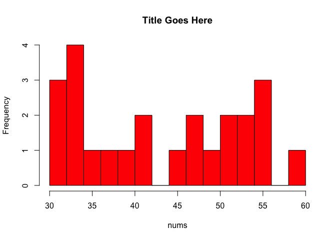
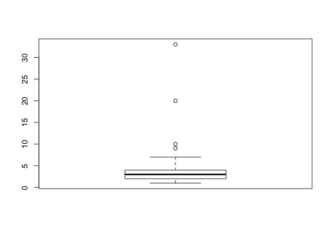
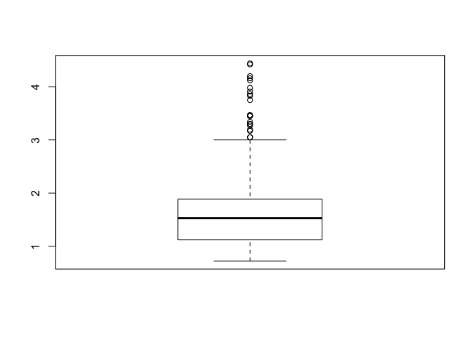
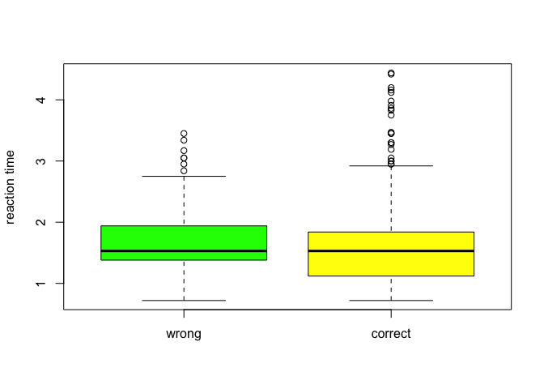

Week 4 Practice 1
================

Central Tendency
----------------

``` r
nums <- sample(30:60, 24, replace=TRUE)
cat(nums)
```

    ## 33 42 32 56 55 47 34 47 52 49 36 60 45 34 38 39 54 30 42 33 30 51 54 55

``` r
summary(nums)
```

    ##    Min. 1st Qu.  Median    Mean 3rd Qu.    Max. 
    ##   30.00   34.00   43.50   43.67   52.50   60.00

``` r
m <- mean(nums)
m.trim <- mean(nums, trim = .1)
med <- median(nums)
cat(m, m.trim, med)
```

    ## 43.66667 43.6 43.5

``` r
hist(nums, main = "Title Goes Here", breaks = 20, col = "red")
```



``` r
library(psych)
describe(nums)
```

    ##    vars  n  mean   sd median trimmed   mad min max range skew kurtosis
    ## X1    1 24 43.67 9.57   43.5    43.6 14.08  30  60    30 0.04    -1.53
    ##      se
    ## X1 1.95

Data Types
----------

### scalar

``` r
scalar_var1 <- 6
scalar_var2 <- "STRING"
scalar_var3 <- TRUE
```

### vector

``` r
vector_var1 <- c(1, 3, 5, 7, 9)  # 限同型別
vector_var2 <- c("apple", "boy", "cat", "dog", 'egg', 'fox', 'girl')
vector_var3 <- c(61:70)  # 字串可用雙引號或單引號
vector_var1[3]  # 索引值從 1 開始
```

    ## [1] 5

``` r
vector_var2[c(2, 4, 6)]
```

    ## [1] "boy" "dog" "fox"

``` r
vector_var3[7:10]  # 包含頭尾
```

    ## [1] 67 68 69 70

``` r
vector_var3[c(7:10)]
```

    ## [1] 67 68 69 70

``` r
vector_var3[11]  # 不存在，NA
```

    ## [1] NA

### vector (advanced)

``` r
vector_var4 <- c(1, 3, 5, 7, 9, "a", "b", "c")
vector_var1[5]
```

    ## [1] 9

``` r
typeof(vector_var1)
```

    ## [1] "double"

``` r
vector_var4[5]
```

    ## [1] "9"

``` r
typeof(vector_var4)
```

    ## [1] "character"

### matrix

``` r
matrix_var1 <- matrix(1:20, nrow = 5, ncol = 4, byrow = FALSE)  # 直列優先
matrix_var2 <- matrix(1:20, nrow = 5, ncol = 4, byrow = TRUE)  # 橫行優先
matrix_var1[2, ]
```

    ## [1]  2  7 12 17

``` r
matrix_var2[2, ]
```

    ## [1] 5 6 7 8

``` r
matrix_var1[, 2]
```

    ## [1]  6  7  8  9 10

``` r
matrix_var2[, 2]
```

    ## [1]  2  6 10 14 18

``` r
matrix_var1[3, 4]
```

    ## [1] 18

``` r
matrix_var2[4, c(1:3)]
```

    ## [1] 13 14 15

### array

``` r
dim1 <- c("A1", "A2")
dim2 <- c("B1", "B2", "B3")
dim3 <- c("C1", "C2", "C3", "C4")
array_var1 <- array(1:24, c(2, 3, 4), dimnames = list(dim1, dim2, dim3))
array_var1
```

    ## , , C1
    ## 
    ##    B1 B2 B3
    ## A1  1  3  5
    ## A2  2  4  6
    ## 
    ## , , C2
    ## 
    ##    B1 B2 B3
    ## A1  7  9 11
    ## A2  8 10 12
    ## 
    ## , , C3
    ## 
    ##    B1 B2 B3
    ## A1 13 15 17
    ## A2 14 16 18
    ## 
    ## , , C4
    ## 
    ##    B1 B2 B3
    ## A1 19 21 23
    ## A2 20 22 24

Draw Boxplot
------------

### read common data

``` r
hospital_len <- read.table("Tab5-2.dat", header = TRUE, na.strings = c("999"))
names(hospital_len)
```

    ## [1] "length"

``` r
dim(hospital_len)
```

    ## [1] 41  1

``` r
str(hospital_len)
```

    ## 'data.frame':    41 obs. of  1 variable:
    ##  $ length: int  2 1 2 3 3 9 4 20 4 1 ...

``` r
head(hospital_len)
```

    ##   length
    ## 1      2
    ## 2      1
    ## 3      2
    ## 4      3
    ## 5      3
    ## 6      9

``` r
table(is.na(hospital_len))
```

    ## 
    ## FALSE  TRUE 
    ##    38     3

### read sav data

``` r
if(!require(haven)) install.packages("haven", repos = "https://cran.r-project.org")
```

    ## Loading required package: haven

``` r
library(haven)
corrects <- read_sav("Fig3-2.sav")
str(corrects)
```

    ## Classes 'tbl_df', 'tbl' and 'data.frame':    85 obs. of  1 variable:
    ##  $ intrus: atomic  0 1 1 2 2 3 4 4 4 5 ...
    ##   ..- attr(*, "format.spss")= chr "F2.0"

``` r
tail(corrects)
```

    ## # A tibble: 6 x 1
    ##   intrus
    ##    <dbl>
    ## 1    28.
    ## 2    28.
    ## 3    29.
    ## 4    30.
    ## 5    30.
    ## 6    35.

``` r
is.integer(corrects$intrus)
```

    ## [1] FALSE

``` r
as.integer(corrects$intrus)
```

    ##  [1]  0  1  1  2  2  3  4  4  4  5  5  5  6  6  7  7  7  7  8  8  9  9 10
    ## [24] 11 11 11 12 12 12 13 13 13 13 13 14 14 14 15 15 15 15 15 15 16 16 16
    ## [47] 16 16 16 16 16 16 16 17 17 17 18 18 18 18 19 19 20 20 21 21 22 22 23
    ## [70] 23 24 24 24 24 25 25 26 26 27 28 28 29 30 30 35

``` r
mean(corrects$intrus)
```

    ## [1] 15.10588

``` r
median(corrects$intrus)
```

    ## [1] 15

### draw stem-and-leaf plot

``` r
library(aplpack)
```

    ## Loading required package: tcltk

``` r
stem.leaf(hospital_len$length, Min = 1, Max = 10, m = 1)
```

    ## 1 | 2: represents 1.2
    ##  leaf unit: 0.1
    ##             n: 38
    ##     3     1 | 000
    ##    12     2 | 000000000
    ##   (11)    3 | 00000000000
    ##    15     4 | 0000000
    ##     8     5 | 00
    ##     6     6 | 0
    ##     5     7 | 0
    ##           8 | 
    ##     4     9 | 0
    ##     3    10 | 0
    ## HI: 20 33
    ## NA's: 3

### draw boxplot

``` r
boxplot(hospital_len$length)
```



### draw boxplot (advanced)

``` r
mental_rotation <- read.table("../week3a/Tab3-1.dat", header = TRUE)
head(mental_rotation)
```

    ##   Trial Angle Stimulus Response RTmsec Accuracy RTsec
    ## 1     1   140   Same--   Same--   4422        1  4.42
    ## 2     2    60   Same--   Same--   1750        1  1.75
    ## 3     3   180   Mirror   Mirror   1437        1  1.44
    ## 4     4   100   Mirror   Same--   1735        0  1.74
    ## 5     5   160   Mirror   Mirror   1937        1  1.94
    ## 6     6   180   Mirror   Mirror   1422        1  1.42

``` r
mental_rotation$Accuracy <- factor(mental_rotation$Accuracy, ordered = TRUE,
                                   levels = c(0, 1), labels = c("wrong", "correct"))
                                   # 有順序性，0 代表 wrong，1 代表 correct
head(mental_rotation)
```

    ##   Trial Angle Stimulus Response RTmsec Accuracy RTsec
    ## 1     1   140   Same--   Same--   4422  correct  4.42
    ## 2     2    60   Same--   Same--   1750  correct  1.75
    ## 3     3   180   Mirror   Mirror   1437  correct  1.44
    ## 4     4   100   Mirror   Same--   1735    wrong  1.74
    ## 5     5   160   Mirror   Mirror   1937  correct  1.94
    ## 6     6   180   Mirror   Mirror   1422  correct  1.42

``` r
boxplot(mental_rotation$RTsec)
```



``` r
boxplot(mental_rotation$RTsec ~ mental_rotation$Accuracy,
        ylab = "reaction time", col = c("green", "yellow"))
```


