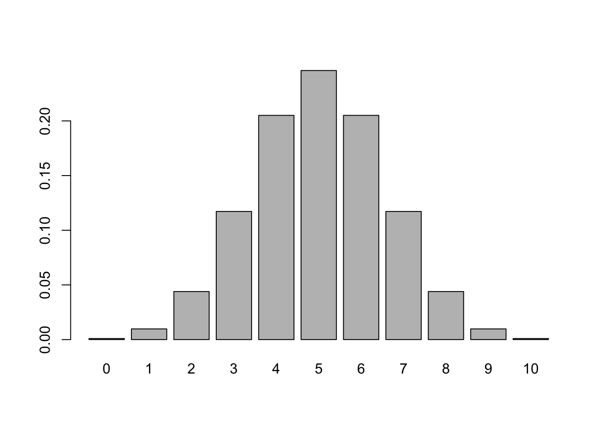

Week 8 Practice 1
================
Yu-Wen Pu
2018-04-17

``` r
knitr::opts_chunk$set(results = "hold", fig.retina = 2)
set.seed(1830)
```

Normal Distribution
-------------------

``` r
dnorm(x = 1, mean = 0, sd = 1)  # density
rnorm(n = 10, mean = 0, sd = 1)  # random generation
pnorm(2, mean = 0, sd = 1)  # distribution function
pnorm(-1, mean = 0, sd = 1)
test <- pnorm(-1, mean = 0, sd = 1)
qnorm(test, mean = 0, sd = 1)  # quantile function
```

    ## [1] 0.2419707
    ##  [1] -1.19016293 -1.47680405  0.96105021 -1.08973917  0.59841346
    ##  [6] -0.84223241  0.01072903 -0.58710833  0.82116264 -0.20643632
    ## [1] 0.9772499
    ## [1] 0.1586553
    ## [1] -1

Binominal Distribution
----------------------

請十個人猜他喝到的飲料是我們的品牌還是另一家知名品牌。
（其實消費者根本就分不出來，只是隨便亂猜。）

``` r
x <- dbinom(x = 0:10, size = 10, prob = .5)
print(x)
sum(x)
barplot(x, names.arg = 0:10)
```



    ##  [1] 0.0009765625 0.0097656250 0.0439453125 0.1171875000 0.2050781250
    ##  [6] 0.2460937500 0.2050781250 0.1171875000 0.0439453125 0.0097656250
    ## [11] 0.0009765625
    ## [1] 1

「十個人當中，至少有五個人選擇我們的品牌」的機率：

``` r
1 - pbinom(4, size = 10, prob = .5)
```

    ## [1] 0.6230469

「十個人當中，至少有四個人選擇我們的品牌」的機率：

``` r
1 - pbinom(3, size = 10, prob = .5)
```

    ## [1] 0.828125

「一百人當中，至少有五成的人選擇我們的品牌」的機率：

``` r
1 - pbinom(40, size = 100, prob = .5)
```

    ## [1] 0.971556

「一百人當中，至少有四成的人選擇我們的品牌」的機率：

``` r
1 - pbinom(30, size = 100, prob = .5)
```

    ## [1] 0.9999607
