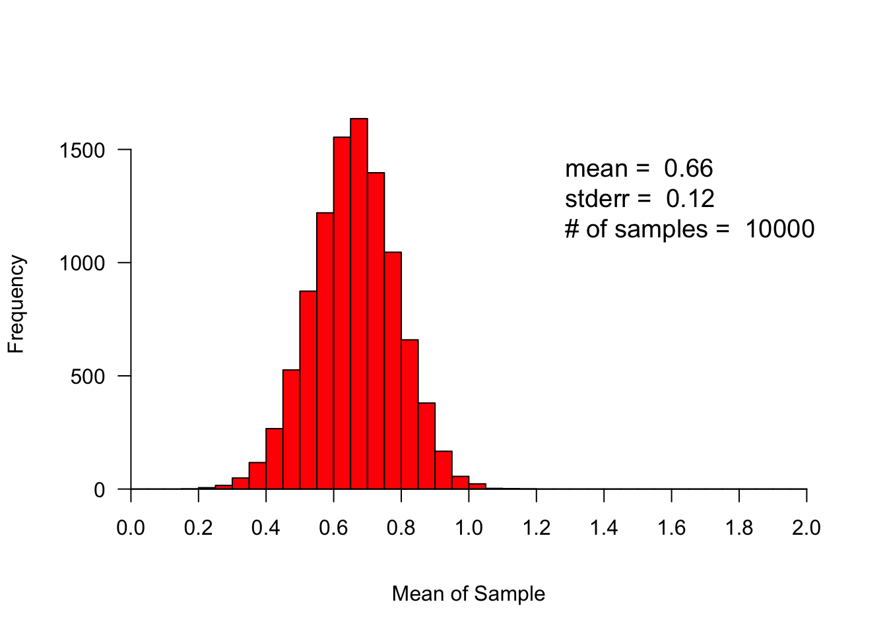

Week 8 Practice 3
================
Yu-Wen Pu
2018-04-17

``` r
knitr::opts_chunk$set(results = "hold", fig.retina = 2)
set.seed(1830)
```

Sampling Error
--------------

``` r
# creates a double-precision vector of the
# specified length with each element equal to 0.
numeric(length = 5)
```

    ## [1] 0 0 0 0 0

``` r
n_samples = 10000
sample_size = 50

xbar <- numeric(length = n_samples)
for (i in 1:n_samples) {
    x <- rnorm(n = sample_size, mean = .66, sd = .88)
    xbar[i] <- mean(x)
}

mean <- round(mean(xbar), digits = 2)
cat("mean of sampling distribution:", mean, "\n")
se <- round(sd(xbar), digits = 2)
cat("standard error of sampling distribution:", se, "\n")
```

    ## mean of sampling distribution: 0.66 
    ## standard error of sampling distribution: 0.12

``` r
upper_limit <- ceiling(max(xbar))
lower_limit <- floor(min(xbar))

hist(xbar, breaks = seq(from = lower_limit, to = upper_limit, by = .05),
     xlab = "Mean of Sample", main = "", xaxt = "n", yaxt = "n", col = "red")
axis(side = 1, at = seq(from = lower_limit, to = upper_limit, by = .2),
     pos = 0, las = 0)
axis(side = 2, pos = lower_limit, las = 2)
legend("topright", paste("mean = ", mean, "\nstderr = ", se, "\n# of samples = ",
        n_samples, "\n"), bty = "n", cex = 1.2)  # cex: 字體大小
```


