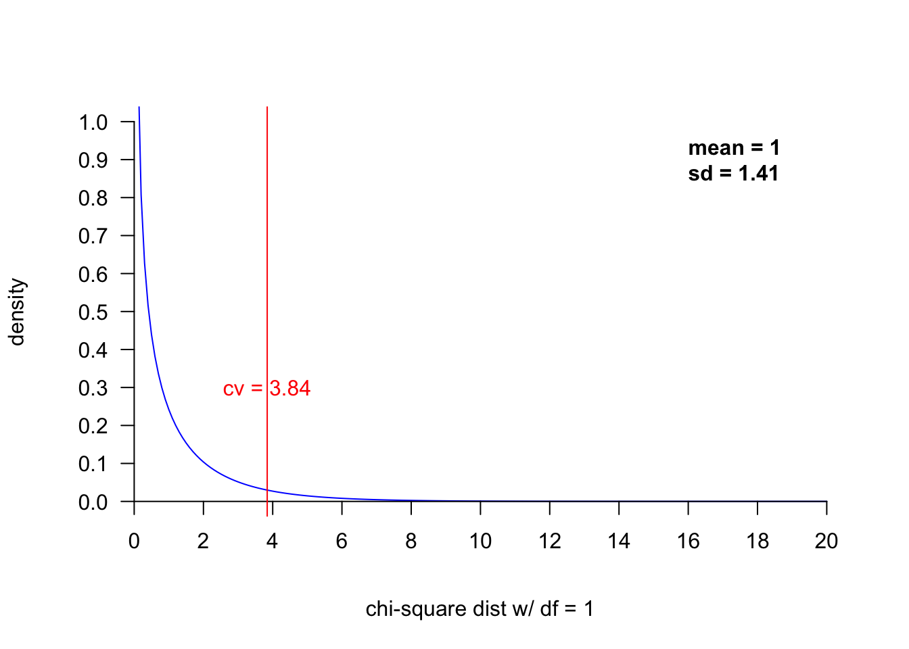

Week 10 Practice 1
================
Yu-Wen Pu
2018-05-01

卡方分佈
--------

``` r
knitr::opts_chunk$set(results = "hold", fig.retina = 2)
set.seed(1830)
```

語法說明
--------

``` r
dchisq(x, df)
pchisq(q, df, lower.tail = TRUE)
qchisq(p, df, lower.tail = TRUE)
rchisq(n, df)
```

``` r
chisq.test(x, correct = TRUE, p = rep(1/length(x), length(x)))
```

``` r
seq(from, to, by)
seq(from, to, length.out)
```

範例（一個變數）
----------------

``` r
chisq.test(c(123, 157), p = c(.5, .5))
```

    ## 
    ##  Chi-squared test for given probabilities
    ## 
    ## data:  c(123, 157)
    ## X-squared = 4.1286, df = 1, p-value = 0.04216

``` r
chisq.test(c(30, 21, 24), p = c(1/3, 1/3, 1/3))
```

    ## 
    ##  Chi-squared test for given probabilities
    ## 
    ## data:  c(30, 21, 24)
    ## X-squared = 1.68, df = 2, p-value = 0.4317

``` r
chisq.test(c(5, 54, 68), p = c(.14, .28, .58))
```

    ## 
    ##  Chi-squared test for given probabilities
    ## 
    ## data:  c(5, 54, 68)
    ## X-squared = 19.183, df = 2, p-value = 6.83e-05

範例（兩個變數）
----------------

``` r
x <- matrix(c(13, 36, 14, 30), byrow = TRUE, ncol = 2)
chisq.test(x, correct = FALSE)
```

    ## 
    ##  Pearson's Chi-squared test
    ## 
    ## data:  x
    ## X-squared = 0.31458, df = 1, p-value = 0.5749

``` r
chisq.test(x, correct = TRUE)
```

    ## 
    ##  Pearson's Chi-squared test with Yates' continuity correction
    ## 
    ## data:  x
    ## X-squared = 0.11029, df = 1, p-value = 0.7398

畫卡方分佈
----------

``` r
x <- seq(0, 20, .1)
k <- 1  # degree of freedom
plot(x, dchisq(x, df = k), xlim = c(0, 20), ylim = c(0, 1), axes = FALSE, type = "l",
     col = "blue", xlab = paste("chi-square dist w/ df =", k), ylab = "density")
     # (axes = FALSE) is equivalent to (xaxt = "n", yaxt = "n")
axis(1, pos = 0, at = seq(0, 20, 2), las = 1)
axis(2, pos = 0, at = seq(0, 1, .1), las = 1)

cv <- qchisq(p = .95, df = k)
# cv <- qchisq(p = .05, df = k, lower.tail = FALSE)
abline(v = cv, col = "#ff0000", lty = 1, lwd = 1)
text(x = cv, y = .3, labels = paste("cv =", round(cv, 2)),
     font = 1, col = "#ff0000", cex = 1)
text(x = 16, y = .9, labels = paste("mean =", k, "\nsd =", round(sqrt(2 * k), 2)),
     font = 2, col = "#000000", cex = 1, adj = 0)
```


