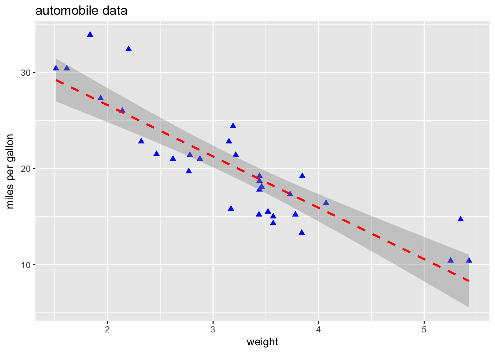
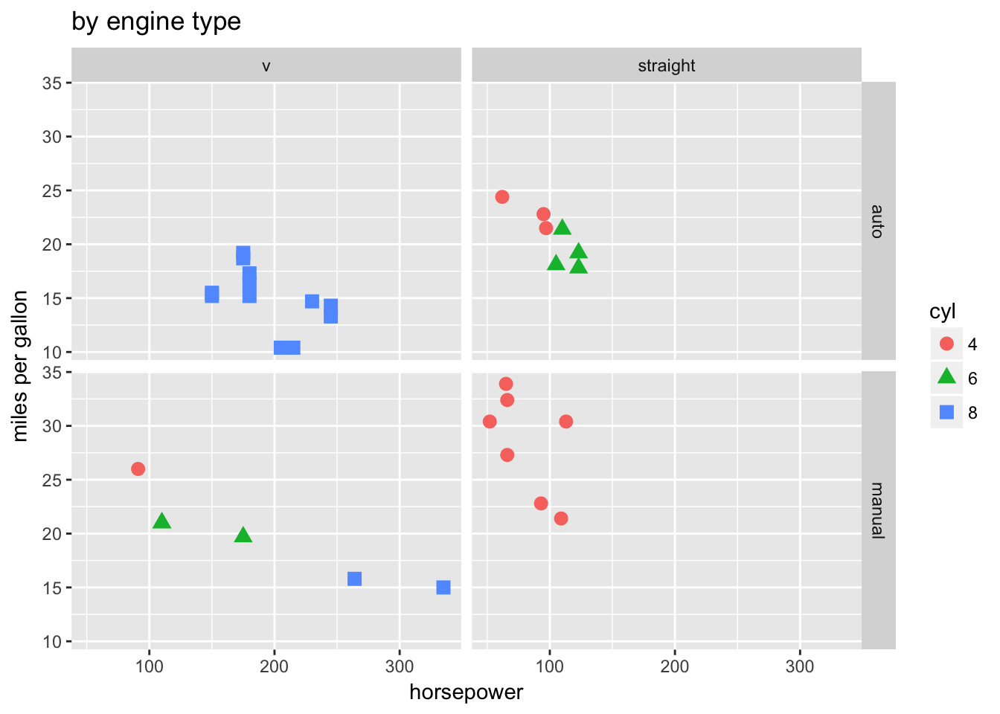
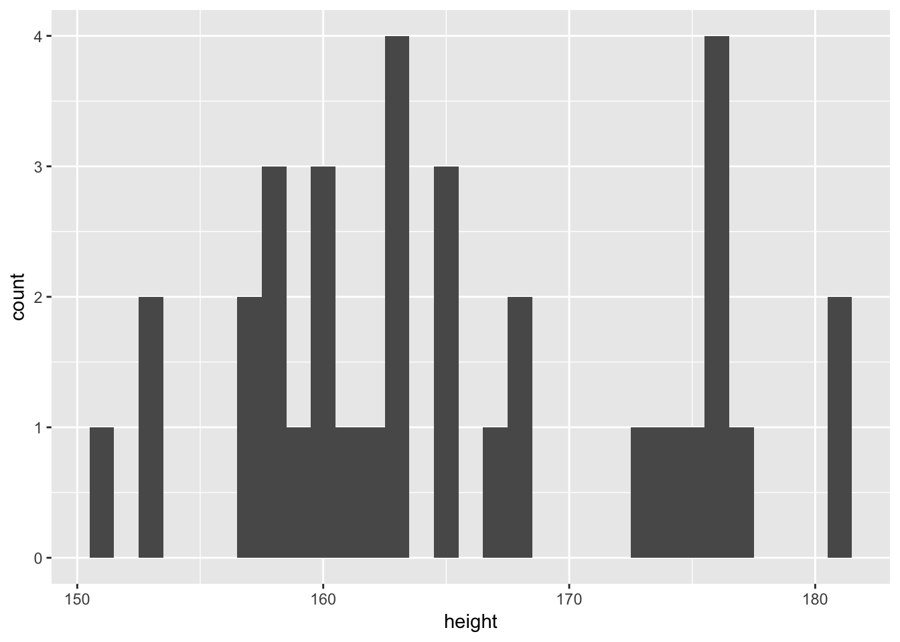
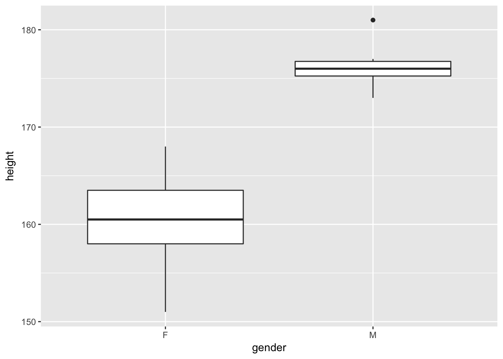
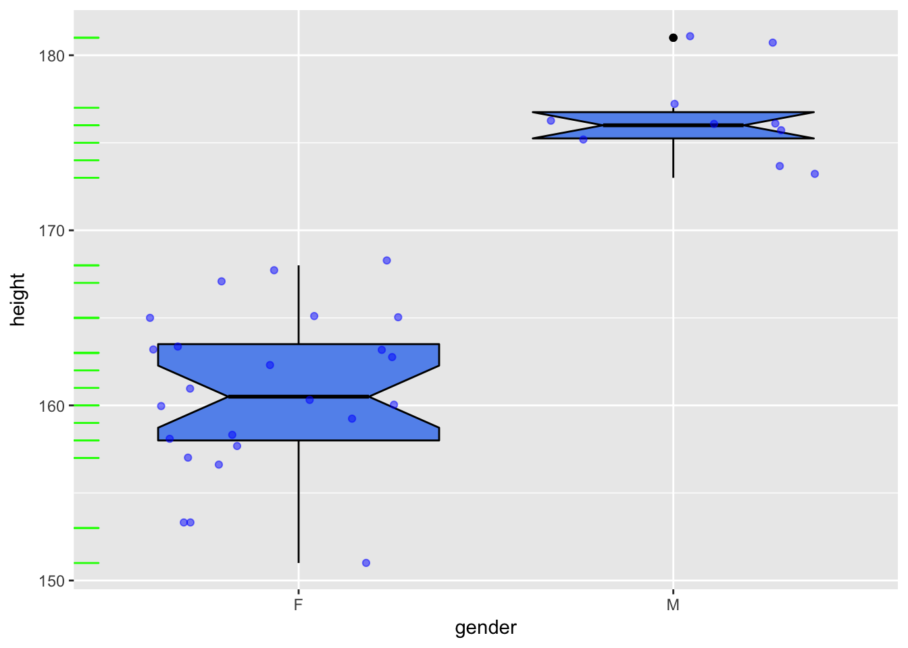
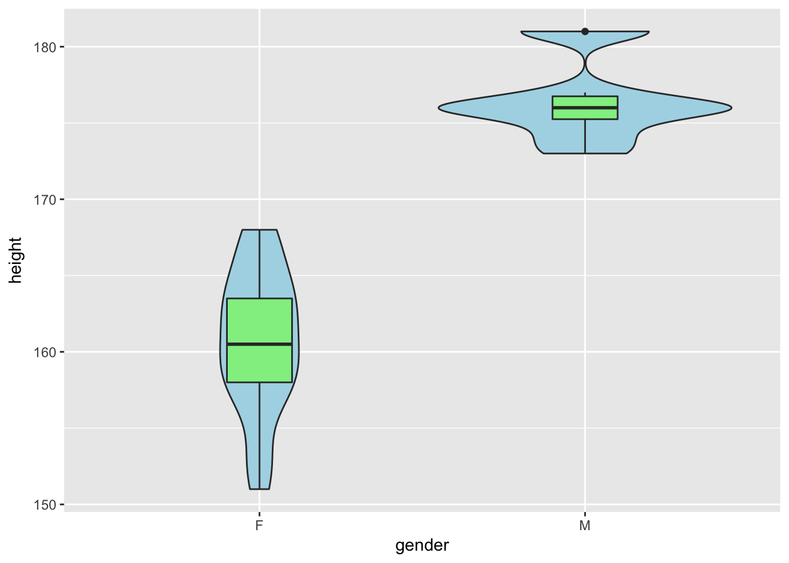
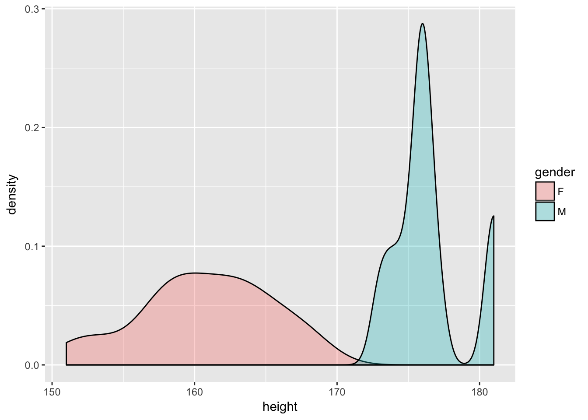
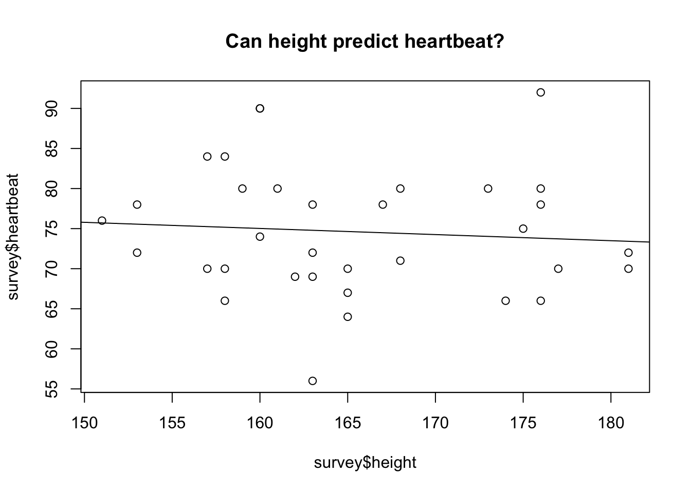

Week 10 Practice 2
================
Yu-Wen Pu
2018-05-01

ggplot2
-------

``` r
knitr::opts_chunk$set(results = "hold", fig.retina = 2)
set.seed(1830)
```

basic plots
-----------

``` r
mtcars <- read.table("mtcars.csv", header = TRUE, sep = ",")
dim(mtcars)
str(mtcars)
```

    ## [1] 32 12
    ## 'data.frame':    32 obs. of  12 variables:
    ##  $ model: Factor w/ 32 levels "AMC Javelin",..: 18 19 5 13 14 31 7 21 20 22 ...
    ##  $ mpg  : num  21 21 22.8 21.4 18.7 18.1 14.3 24.4 22.8 19.2 ...
    ##  $ cyl  : int  6 6 4 6 8 6 8 4 4 6 ...
    ##  $ disp : num  160 160 108 258 360 ...
    ##  $ hp   : int  110 110 93 110 175 105 245 62 95 123 ...
    ##  $ drat : num  3.9 3.9 3.85 3.08 3.15 2.76 3.21 3.69 3.92 3.92 ...
    ##  $ wt   : num  2.62 2.88 2.32 3.21 3.44 ...
    ##  $ qsec : num  16.5 17 18.6 19.4 17 ...
    ##  $ vs   : int  0 0 1 1 0 1 0 1 1 1 ...
    ##  $ am   : int  1 1 1 0 0 0 0 0 0 0 ...
    ##  $ gear : int  4 4 4 3 3 3 3 4 4 4 ...
    ##  $ carb : int  4 4 1 1 2 1 4 2 2 4 ...

``` r
library(ggplot2)
ggplot(data = mtcars, aes(x = wt, y = mpg)) + geom_point() +
    labs(title = "automobile data", x = "weight", y = "miles per gallon")
```


``` r
library(ggplot2)
ggplot(data = mtcars, aes(x = wt, y = mpg)) + 
    geom_point(pch = 17, color = "blue", size = 2) +
    geom_smooth(method = "lm", color = "red", linetype = 2) +
    labs(title = "automobile data", x = "weight", y = "miles per gallon")
```



灰底區域表示 95% 信賴區間。

grouping v.s. faceting
----------------------

``` r
mtcars$am <- factor(mtcars$am, levels = c(0, 1), labels = c("auto", "manual"))
mtcars$vs <- factor(mtcars$vs, levels = c(0, 1), labels = c("v", "straight"))
mtcars$cyl <- factor(mtcars$cyl)
str(mtcars)
```

    ## 'data.frame':    32 obs. of  12 variables:
    ##  $ model: Factor w/ 32 levels "AMC Javelin",..: 18 19 5 13 14 31 7 21 20 22 ...
    ##  $ mpg  : num  21 21 22.8 21.4 18.7 18.1 14.3 24.4 22.8 19.2 ...
    ##  $ cyl  : Factor w/ 3 levels "4","6","8": 2 2 1 2 3 2 3 1 1 2 ...
    ##  $ disp : num  160 160 108 258 360 ...
    ##  $ hp   : int  110 110 93 110 175 105 245 62 95 123 ...
    ##  $ drat : num  3.9 3.9 3.85 3.08 3.15 2.76 3.21 3.69 3.92 3.92 ...
    ##  $ wt   : num  2.62 2.88 2.32 3.21 3.44 ...
    ##  $ qsec : num  16.5 17 18.6 19.4 17 ...
    ##  $ vs   : Factor w/ 2 levels "v","straight": 1 1 2 2 1 2 1 2 2 2 ...
    ##  $ am   : Factor w/ 2 levels "auto","manual": 2 2 2 1 1 1 1 1 1 1 ...
    ##  $ gear : int  4 4 4 3 3 3 3 4 4 4 ...
    ##  $ carb : int  4 4 1 1 2 1 4 2 2 4 ...

``` r
ggplot(data = mtcars, aes(x = hp, y = mpg, shape = cyl, color = cyl)) +
    geom_point(size = 3) +
    facet_grid(am~vs) +
    labs(title = "by engine type", x = "horsepower", y = "miles per gallon")
```



geom\_\* functions
------------------

``` r
survey <- read.table("../week7/2018class.csv", header = TRUE, sep = ",")
survey$gender <- factor(survey$gender, levels = c(1, 2), labels = c("F", "M"))
```

``` r
ggplot(data = survey, aes(x = height)) + geom_histogram(binwidth = 1)
```



``` r
ggplot(data = survey, aes(x = gender, y = height)) + geom_boxplot()
```



``` r
ggplot(data = survey, aes(x = gender, y = height)) +
    geom_boxplot(fill = "cornflowerblue", color = "black", notch = TRUE) +
    geom_point(position = "jitter", color = "blue", alpha = .5) +
    geom_rug(sides = "l", color = "green")
```



``` r
ggplot(data = survey, aes(x = gender, y = height)) +
    geom_violin(fill = "lightblue") +
    geom_boxplot(fill = "lightgreen", width = .2)
```



``` r
ggplot(data = survey, aes(x = height, fill = gender)) +
    geom_density(alpha = .3)
```



simple regression (linear model)
--------------------------------

``` r
plot(survey$height, survey$heartbeat)
abline(lm(survey$heartbeat~survey$height))
title("Can height predict heartbeat?")
```


