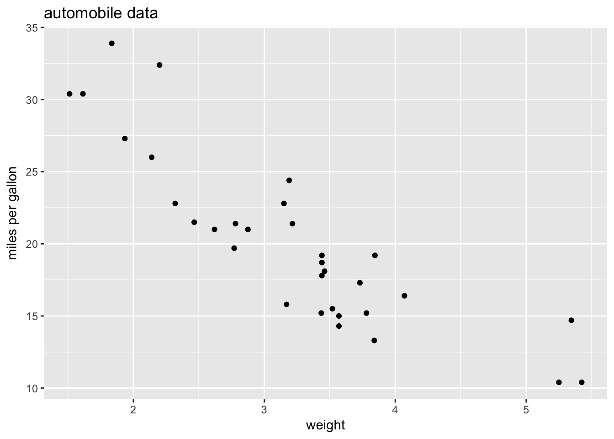

Week 10 Practice 2
================
Yu-Wen Pu
2018-05-01

ggplot2
-------

``` r
knitr::opts_chunk$set(results = "hold", fig.retina = 2)
set.seed(1830)
```

範例
----

``` r
mtcars <- read.table("mtcars.csv", header = TRUE, sep = ",")
dim(mtcars)
str(mtcars)
```

    ## [1] 32 12
    ## 'data.frame':    32 obs. of  12 variables:
    ##  $ model: Factor w/ 32 levels "AMC Javelin",..: 18 19 5 13 14 31 7 21 20 22 ...
    ##  $ mpg  : num  21 21 22.8 21.4 18.7 18.1 14.3 24.4 22.8 19.2 ...
    ##  $ cyl  : int  6 6 4 6 8 6 8 4 4 6 ...
    ##  $ disp : num  160 160 108 258 360 ...
    ##  $ hp   : int  110 110 93 110 175 105 245 62 95 123 ...
    ##  $ drat : num  3.9 3.9 3.85 3.08 3.15 2.76 3.21 3.69 3.92 3.92 ...
    ##  $ wt   : num  2.62 2.88 2.32 3.21 3.44 ...
    ##  $ qsec : num  16.5 17 18.6 19.4 17 ...
    ##  $ vs   : int  0 0 1 1 0 1 0 1 1 1 ...
    ##  $ am   : int  1 1 1 0 0 0 0 0 0 0 ...
    ##  $ gear : int  4 4 4 3 3 3 3 4 4 4 ...
    ##  $ carb : int  4 4 1 1 2 1 4 2 2 4 ...

``` r
library(ggplot2)
ggplot(data = mtcars, aes(x = wt, y = mpg)) + geom_point() +
    labs(title = "automobile data", x = "weight", y = "miles per gallon")
```


