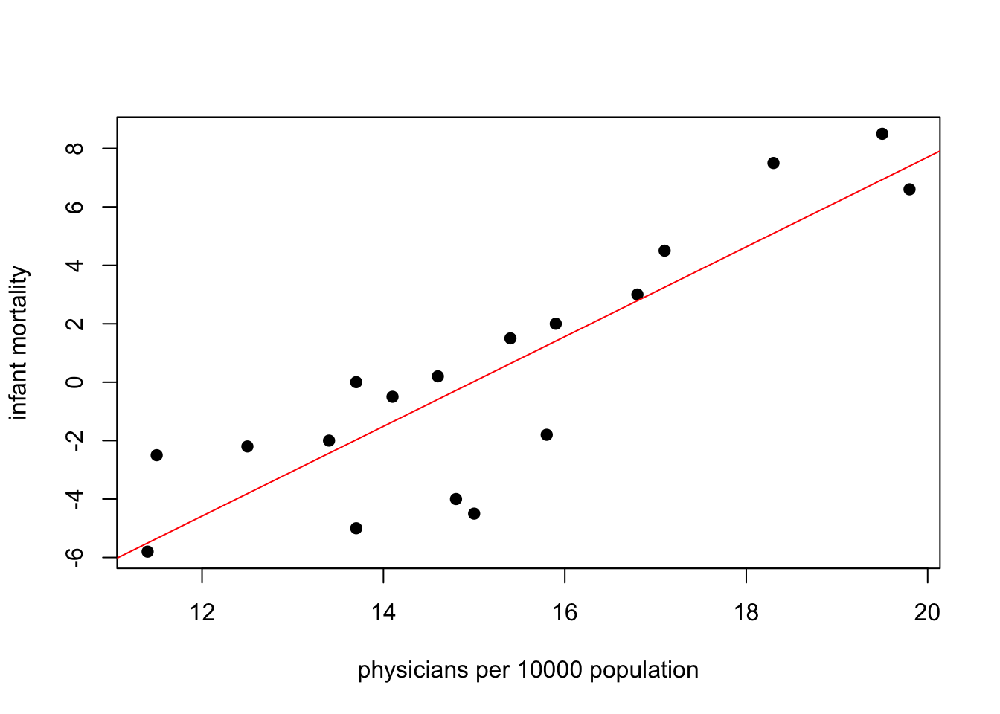
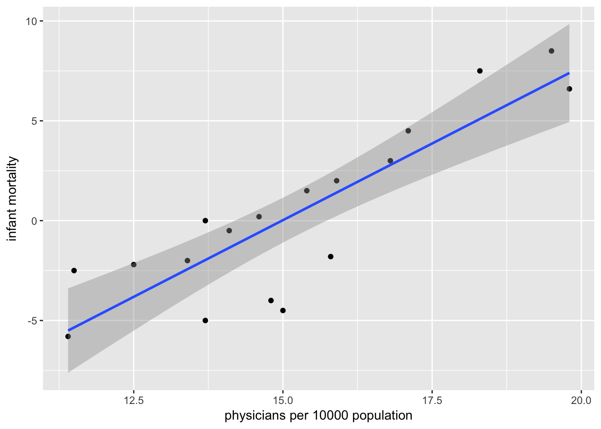
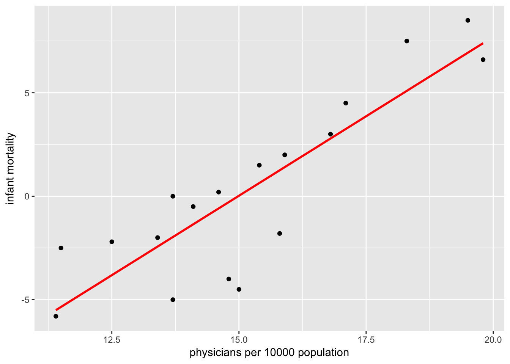
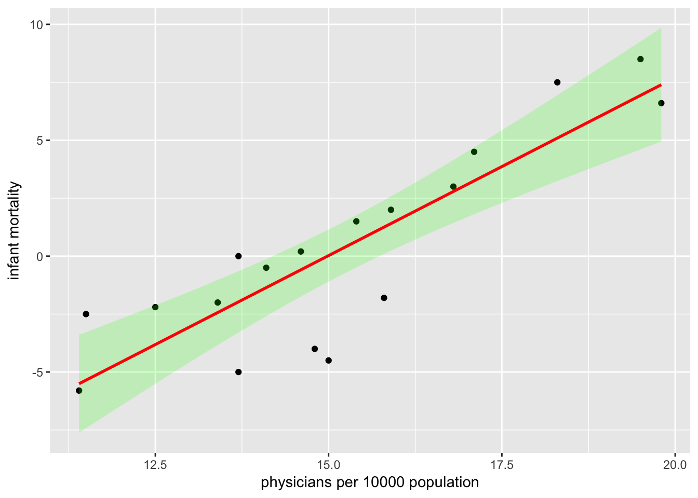

Week 11 Practice 2
================
Yu-Wen Pu
2018-05-08

Correlation
-----------

``` r
knitr::opts_chunk$set(results = "hold", fig.retina = 2)
set.seed(1830)
```

### part 1

``` r
x <- read.table("Fig9-1.dat", header = TRUE, sep = "")
dim(x)
str(x)
head(x)
```

    ## [1] 18  3
    ## 'data.frame':    18 obs. of  3 variables:
    ##  $ Doctors: num  11.5 13.4 19.8 12.5 16.8 19.5 11.4 15.4 18.3 13.7 ...
    ##  $ Infmort: num  -2.5 -2 6.6 -2.2 3 8.5 -5.8 1.5 7.5 -5 ...
    ##  $ Country: Factor w/ 18 levels "Australi","Austria",..: 10 6 2 13 3 11 7 17 9 12 ...
    ##   Doctors Infmort  Country
    ## 1    11.5    -2.5  Ireland
    ## 2    13.4    -2.0 Eng-Wale
    ## 3    19.8     6.6  Austria
    ## 4    12.5    -2.2 New_Zeal
    ## 5    16.8     3.0  Belgium
    ## 6    19.5     8.5    Italy

``` r
plot(x$Doctors, x$Infmort, xlab = "physicians per 10000 population",
     ylab = "infant mortality", pch = 19)
abline(lm(x$Infmort ~ x$Doctors), col = "red")
```



### part 2

``` r
library(ggplot2)
scatter <- ggplot(x, aes(x = Doctors, y = Infmort))
scatter + geom_point() + geom_smooth(method = "lm") +
    labs(x = "physicians per 10000 population", y = "infant mortality")
```



``` r
scatter + geom_point() + geom_smooth(method = "lm", color = "red", se = FALSE) +
    labs(x = "physicians per 10000 population", y = "infant mortality")
```



``` r
scatter + geom_point() + 
    geom_smooth(method = "lm", color = "red", alpha = .2, fill = "green") +
    labs(x = "physicians per 10000 population", y = "infant mortality")
```



### part 3

``` r
x <- read.table("Fig9-5.dat", header = TRUE, sep = "")
head(x, n = 3)
cor(x$Pace, x$Heart)
cor.test(x$Pace, x$Heart)
```

    ##   Bank Walk Talk  Pace Heart
    ## 1   31   28   24 27.67    24
    ## 2   30   23   23 25.33    29
    ## 3   29   24   18 23.67    31
    ## [1] 0.3651289
    ## 
    ##  Pearson's product-moment correlation
    ## 
    ## data:  x$Pace and x$Heart
    ## t = 2.2869, df = 34, p-value = 0.02855
    ## alternative hypothesis: true correlation is not equal to 0
    ## 95 percent confidence interval:
    ##  0.04158114 0.61936671
    ## sample estimates:
    ##       cor 
    ## 0.3651289

### part 4

``` r
library(haven)
x <- read_sav("tcs04.sav")
dim(x)
```

    ## [1] 2002  698

``` r
gender <- table(x$gender)
gender
chisq.test(gender)
```

    ## 
    ##    1    2 
    ##  928 1074 
    ## 
    ##  Chi-squared test for given probabilities
    ## 
    ## data:  gender
    ## X-squared = 10.647, df = 1, p-value = 0.001102

``` r
table(x$P5)
table(is.na(x$P5))
```

    ## 
    ##   1   2   3  99 
    ##  47  68  22 485 
    ## 
    ## FALSE  TRUE 
    ##   622  1380
