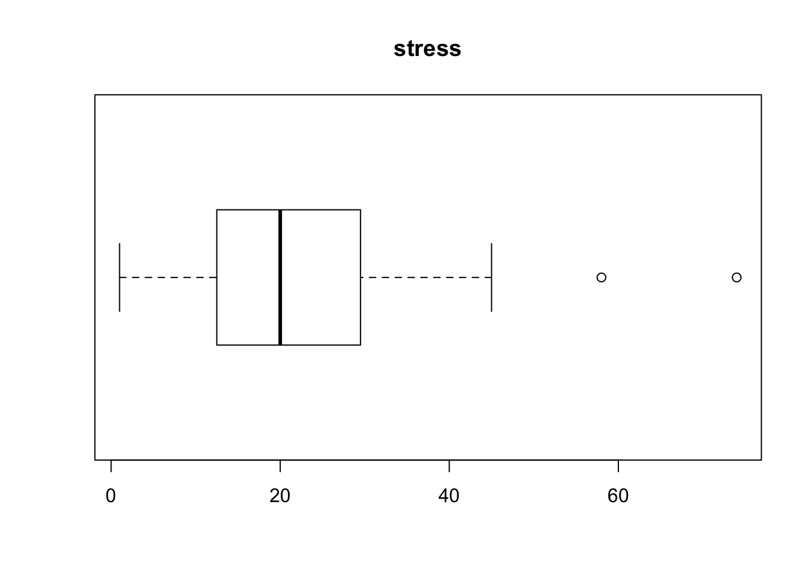

Week 12 Practice 1
================
Yu-Wen Pu
2018-05-21

regression
----------

``` r
knitr::opts_chunk$set(results = "hold", fig.retina = 2)
set.seed(1830)
```

### part 1

``` r
d <- read.table("Tab10-1.dat", header = TRUE, sep = "")
library(aplpack)
```

    ## Loading required package: tcltk

``` r
stem.leaf(d$Stress)
boxplot(d$Stress, horizontal = TRUE, main = "stress")
```



    ## 1 | 2: represents 12
    ##  leaf unit: 1
    ##             n: 107
    ##     7    0* | 1123334
    ##    20    0. | 5567788899999
    ##    35    1* | 011222233333444
    ##    53    1. | 555555566667778889
    ##   (19)   2* | 0000011222223333444
    ##    35    2. | 56777899
    ##    27    3* | 0013334444
    ##    17    3. | 66778889
    ##     9    4* | 334
    ##     6    4. | 5555
    ## HI: 58 74

``` r
stem.leaf(d$Symptoms)
boxplot(d$Symptoms, horizontal = TRUE, main = "symptoms")
```


    ## 1 | 2: represents 12
    ##  leaf unit: 1
    ##             n: 107
    ##     1     5. | 8
    ##     7     6* | 112234
    ##    12     6. | 55668
    ##    23     7* | 00012334444
    ##    31     7. | 57788899
    ##    45     8* | 00011122233344
    ##   (13)    8. | 5666677888899
    ##    49     9* | 0111223344
    ##    39     9. | 556679999
    ##    30    10* | 0001112224
    ##    20    10. | 567799
    ##    14    11* | 112
    ##    11    11. | 78
    ##     9    12* | 11
    ##     7    12. | 57
    ##     5    13* | 1
    ##     4    13. | 55
    ## HI: 147 186

### part 2

``` r
cor.test(d$Stress, d$Symptoms, alternative = "two.sided")
```

    ## 
    ##  Pearson's product-moment correlation
    ## 
    ## data:  d$Stress and d$Symptoms
    ## t = 6.012, df = 105, p-value = 2.692e-08
    ## alternative hypothesis: true correlation is not equal to 0
    ## 95 percent confidence interval:
    ##  0.3497942 0.6349041
    ## sample estimates:
    ##       cor 
    ## 0.5060454

### part 3

``` r
(regress <- lm(d$Symptoms ~ d$Stress))
cat(strrep("#", 32), fill = TRUE)
summary(regress)
cat(strrep("#", 32), fill = TRUE)
str(regress)
```

    ## 
    ## Call:
    ## lm(formula = d$Symptoms ~ d$Stress)
    ## 
    ## Coefficients:
    ## (Intercept)     d$Stress  
    ##     73.8896       0.7831  
    ## 
    ## ################################
    ## 
    ## Call:
    ## lm(formula = d$Symptoms ~ d$Stress)
    ## 
    ## Residuals:
    ##     Min      1Q  Median      3Q     Max 
    ## -38.347 -13.197  -1.070   6.755  82.352 
    ## 
    ## Coefficients:
    ##             Estimate Std. Error t value Pr(>|t|)    
    ## (Intercept)  73.8896     3.2714  22.587  < 2e-16 ***
    ## d$Stress      0.7831     0.1303   6.012 2.69e-08 ***
    ## ---
    ## Signif. codes:  0 '***' 0.001 '**' 0.01 '*' 0.05 '.' 0.1 ' ' 1
    ## 
    ## Residual standard error: 17.56 on 105 degrees of freedom
    ## Multiple R-squared:  0.2561, Adjusted R-squared:  0.249 
    ## F-statistic: 36.14 on 1 and 105 DF,  p-value: 2.692e-08
    ## 
    ## ################################
    ## List of 12
    ##  $ coefficients : Named num [1:2] 73.89 0.783
    ##   ..- attr(*, "names")= chr [1:2] "(Intercept)" "d$Stress"
    ##  $ residuals    : Named num [1:107] 1.617 -1.034 -0.938 -19.552 23.761 ...
    ##   ..- attr(*, "names")= chr [1:107] "1" "2" "3" "4" ...
    ##  $ effects      : Named num [1:107] -938.22 -105.59 -1.19 -19.71 23.46 ...
    ##   ..- attr(*, "names")= chr [1:107] "(Intercept)" "d$Stress" "" "" ...
    ##  $ rank         : int 2
    ##  $ fitted.values: Named num [1:107] 97.4 95 80.9 89.6 76.2 ...
    ##   ..- attr(*, "names")= chr [1:107] "1" "2" "3" "4" ...
    ##  $ assign       : int [1:2] 0 1
    ##  $ qr           :List of 5
    ##   ..$ qr   : num [1:107, 1:2] -10.3441 0.0967 0.0967 0.0967 0.0967 ...
    ##   .. ..- attr(*, "dimnames")=List of 2
    ##   .. .. ..$ : chr [1:107] "1" "2" "3" "4" ...
    ##   .. .. ..$ : chr [1:2] "(Intercept)" "d$Stress"
    ##   .. ..- attr(*, "assign")= int [1:2] 0 1
    ##   ..$ qraux: num [1:2] 1.1 1.04
    ##   ..$ pivot: int [1:2] 1 2
    ##   ..$ tol  : num 1e-07
    ##   ..$ rank : int 2
    ##   ..- attr(*, "class")= chr "qr"
    ##  $ df.residual  : int 105
    ##  $ xlevels      : Named list()
    ##  $ call         : language lm(formula = d$Symptoms ~ d$Stress)
    ##  $ terms        :Classes 'terms', 'formula'  language d$Symptoms ~ d$Stress
    ##   .. ..- attr(*, "variables")= language list(d$Symptoms, d$Stress)
    ##   .. ..- attr(*, "factors")= int [1:2, 1] 0 1
    ##   .. .. ..- attr(*, "dimnames")=List of 2
    ##   .. .. .. ..$ : chr [1:2] "d$Symptoms" "d$Stress"
    ##   .. .. .. ..$ : chr "d$Stress"
    ##   .. ..- attr(*, "term.labels")= chr "d$Stress"
    ##   .. ..- attr(*, "order")= int 1
    ##   .. ..- attr(*, "intercept")= int 1
    ##   .. ..- attr(*, "response")= int 1
    ##   .. ..- attr(*, ".Environment")=<environment: R_GlobalEnv> 
    ##   .. ..- attr(*, "predvars")= language list(d$Symptoms, d$Stress)
    ##   .. ..- attr(*, "dataClasses")= Named chr [1:2] "numeric" "numeric"
    ##   .. .. ..- attr(*, "names")= chr [1:2] "d$Symptoms" "d$Stress"
    ##  $ model        :'data.frame':   107 obs. of  2 variables:
    ##   ..$ d$Symptoms: int [1:107] 99 94 80 70 100 109 62 81 74 121 ...
    ##   ..$ d$Stress  : int [1:107] 30 27 9 20 3 15 5 10 23 34 ...
    ##   ..- attr(*, "terms")=Classes 'terms', 'formula'  language d$Symptoms ~ d$Stress
    ##   .. .. ..- attr(*, "variables")= language list(d$Symptoms, d$Stress)
    ##   .. .. ..- attr(*, "factors")= int [1:2, 1] 0 1
    ##   .. .. .. ..- attr(*, "dimnames")=List of 2
    ##   .. .. .. .. ..$ : chr [1:2] "d$Symptoms" "d$Stress"
    ##   .. .. .. .. ..$ : chr "d$Stress"
    ##   .. .. ..- attr(*, "term.labels")= chr "d$Stress"
    ##   .. .. ..- attr(*, "order")= int 1
    ##   .. .. ..- attr(*, "intercept")= int 1
    ##   .. .. ..- attr(*, "response")= int 1
    ##   .. .. ..- attr(*, ".Environment")=<environment: R_GlobalEnv> 
    ##   .. .. ..- attr(*, "predvars")= language list(d$Symptoms, d$Stress)
    ##   .. .. ..- attr(*, "dataClasses")= Named chr [1:2] "numeric" "numeric"
    ##   .. .. .. ..- attr(*, "names")= chr [1:2] "d$Symptoms" "d$Stress"
    ##  - attr(*, "class")= chr "lm"

``` r
plot(d$Stress, d$Symptoms, xlim = c(0, 80), ylim = c(50, 200),
     main = "symptoms as a function of stress",
     xlab = "stress", ylab = "symptoms",
     pch = 19, bty = "n")
abline(lm(d$Symptoms ~ d$Stress), col = "red")
b <- round(regress$coefficients[["d$Stress"]], digits = 2)
a <- round(regress$coefficients[["(Intercept)"]], digits = 2)
legend(35, 175, substitute(
        paste(hat(Y), " = ", b, " * X + ", a),
        list(b = b, a = a)
    ), bty = "n")
```


