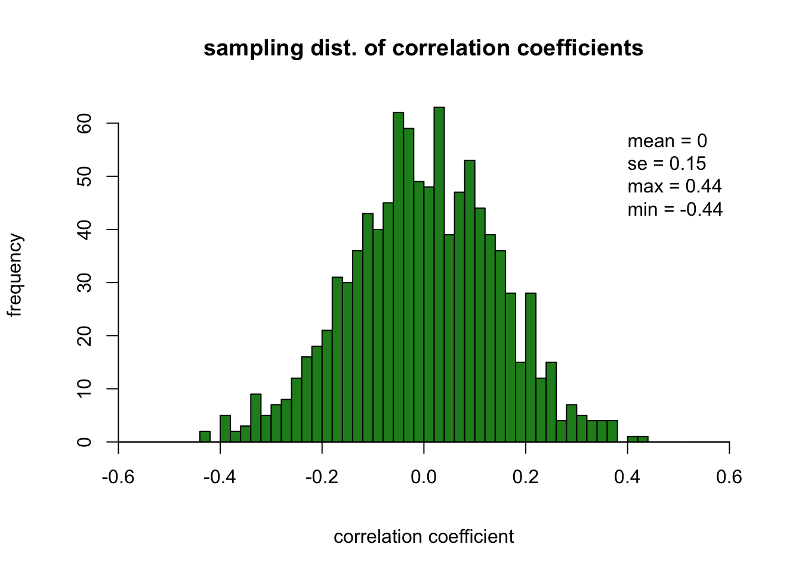

Week 13 Practice 2
================
Yu-Wen Pu
2018-05-28

correlation（補上週課程）
-------------------------

``` r
knitr::opts_chunk$set(results = "hold", fig.retina = 2)
set.seed(1830)
```

### What is the correlation coefficient between two sets of random numbers?

``` r
random_income <- rnorm(25, mean = 0, sd = 1)
random_musicality <- rnorm(25, mean = 0, sd = 1)
d <- data.frame(income = random_income, musicality = random_musicality)
head(d)
```

    ##       income musicality
    ## 1 -1.1901629  1.0367239
    ## 2 -1.4768040 -1.0268828
    ## 3  0.9610502  0.6601341
    ## 4 -1.0897392  0.5740637
    ## 5  0.5984135  1.2415157
    ## 6 -0.8422324 -1.3389296

``` r
(results <- cor.test(d$income, d$musicality))
correlation <- round(results$estimate, digits = 3)
p_value <- round(results$p.value, digits = 3)
```

    ## 
    ##  Pearson's product-moment correlation
    ## 
    ## data:  d$income and d$musicality
    ## t = -0.77199, df = 23, p-value = 0.448
    ## alternative hypothesis: true correlation is not equal to 0
    ## 95 percent confidence interval:
    ##  -0.5213195  0.2520320
    ## sample estimates:
    ##        cor 
    ## -0.1589256

``` r
plot(d$income, d$musicality,
     main = paste("r = ", correlation, ", p = ", p_value, sep = ""),
     xlab = "income", ylab = "musicality", pch = 19)
abline(lm(d$musicality ~ d$income), col = "red")
```


### Testing the significance of a correlation coefficient

``` r
par(mfrow = c(1, 1))
number_of_sample <- 1000
sample_size <- 50
correlation <- numeric(number_of_sample)
x_name <- "income"
y_name <- "musicality"
hist_break <- 0.02
interval <- 0.2

for (i in 1:number_of_sample) {
    x <- rnorm(sample_size, mean = 0, sd = 1)
    y <- rnorm(sample_size, mean = 0, sd = 1)
    d <- data.frame(x_name = x, y_name = y)
    correlation[i] <- cor(d$x_name, d$y_name)
}

correlation_mean <- round(mean(correlation), digits = 2)
correlation_sd <- round(sd(correlation), digits = 2)

uplimit <- ceiling(max(correlation) / interval) * interval
lowlimit <- floor(min(correlation) / interval) * interval

results <- hist(correlation,
                breaks = seq(from = lowlimit, to = uplimit, by = hist_break),
                plot = FALSE)
str(results)
textbox_x <- uplimit - interval
textbox_y <- 0.8 * max(results$counts)

hist(correlation, breaks = seq(from = lowlimit, to = uplimit, by = hist_break),
     xlab = "correlation coefficient", ylab = "frequency",
     main = "sampling dist. of correlation coefficients",
     xaxt = "n", yaxt = "n", col = "forestgreen")
axis(side = 1, at = seq(from = lowlimit, to = uplimit, by = interval),
     pos = 0, las = 0)
axis(side = 2, pos = lowlimit, las = 0)
text(x = textbox_x, y = textbox_y, labels = paste(
    "mean = ", correlation_mean, "\nse = ", correlation_sd,
    "\nmax = ", round(max(correlation), digits = 2),
    "\nmin = ", round(min(correlation), digits = 2),
    sep = ""), adj = 0)
```



    ## List of 6
    ##  $ breaks  : num [1:61] -0.6 -0.58 -0.56 -0.54 -0.52 -0.5 -0.48 -0.46 -0.44 -0.42 ...
    ##  $ counts  : int [1:60] 0 0 0 0 0 0 0 0 2 0 ...
    ##  $ density : num [1:60] 0 0 0 0 0 ...
    ##  $ mids    : num [1:60] -0.59 -0.57 -0.55 -0.53 -0.51 -0.49 -0.47 -0.45 -0.43 -0.41 ...
    ##  $ xname   : chr "correlation"
    ##  $ equidist: logi TRUE
    ##  - attr(*, "class")= chr "histogram"
