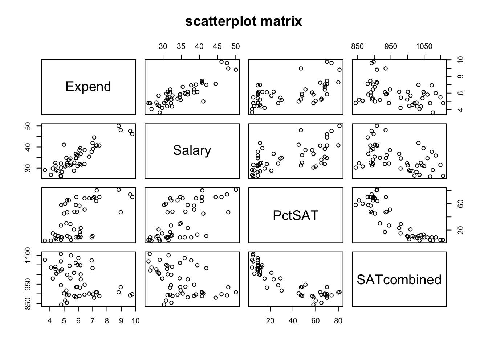

Week 15 Practice 1
================
Yu-Wen Pu
2018-06-05

multiple regression
-------------------

``` r
knitr::opts_chunk$set(fig.retina = 2)
set.seed(1830)
```

### read dataset: funding our schools

``` r
d <- read.table("Tab11-1.dat", header = TRUE, sep = "")
dim(d)
```

    ## [1] 50 12

``` r
str(d)
```

    ## 'data.frame':    50 obs. of  12 variables:
    ##  $ id         : int  1 2 3 4 5 6 7 8 9 10 ...
    ##  $ State      : Factor w/ 50 levels "Alabama","Alaska",..: 1 2 3 4 5 6 7 8 9 10 ...
    ##  $ Expend     : num  4.41 8.96 4.78 4.46 4.99 ...
    ##  $ PTratio    : num  17.2 17.6 19.3 17.1 24 18.4 14.4 16.6 19.1 16.3 ...
    ##  $ Salary     : num  31.1 48 32.2 28.9 41.1 ...
    ##  $ PctSAT     : int  8 47 27 6 45 29 81 68 48 65 ...
    ##  $ Verbal     : int  491 445 448 482 417 462 431 429 420 406 ...
    ##  $ Math       : int  538 489 496 523 485 518 477 468 469 448 ...
    ##  $ SATcombined: int  1029 934 944 1005 902 980 908 897 889 854 ...
    ##  $ PctACT     : int  61 32 27 66 11 62 3 3 36 16 ...
    ##  $ ACTcombined: num  20.2 21 21.1 20.3 21 21.5 21.7 21 20.7 20.2 ...
    ##  $ LogPctSAT  : num  2.08 3.85 3.3 1.79 3.81 ...

``` r
head(d)
```

    ##   id   State Expend PTratio Salary PctSAT Verbal Math SATcombined PctACT
    ## 1  1 Alabama  4.405    17.2 31.144      8    491  538        1029     61
    ## 2  2  Alaska  8.963    17.6 47.951     47    445  489         934     32
    ## 3  3 Arizona  4.778    19.3 32.175     27    448  496         944     27
    ## 4  4     Ark  4.459    17.1 28.934      6    482  523        1005     66
    ## 5  5   Calif  4.992    24.0 41.078     45    417  485         902     11
    ## 6  6     Col  5.443    18.4 34.571     29    462  518         980     62
    ##   ACTcombined LogPctSAT
    ## 1        20.2     2.079
    ## 2        21.0     3.850
    ## 3        21.1     3.296
    ## 4        20.3     1.792
    ## 5        21.0     3.807
    ## 6        21.5     3.367

``` r
library(aplpack)
```

    ## Loading required package: tcltk

``` r
stem.leaf(d$Expend, m = 1)
```

    ## 1 | 2: represents 1.2
    ##  leaf unit: 0.1
    ##             n: 50
    ##     1    3 | 6
    ##    14    4 | 0234457777789
    ##   (16)   5 | 0112233446788899
    ##    20    6 | 00111144799
    ##     9    7 | 01224
    ##     4    8 | 89
    ##     2    9 | 67

``` r
stem.leaf(d$SATcombined, m = 2)
```

    ## 1 | 2: represents 120
    ##  leaf unit: 10
    ##             n: 50
    ##    1     8* | 4
    ##   14     8. | 5688888999999
    ##   26     9* | 000001333344
    ##   (4)    9. | 7789
    ##   20    10* | 000122233444
    ##    8    10. | 5667789
    ##    1    11* | 0

``` r
stem.leaf(d$PctSAT, m = 1)
```

    ## 1 | 2: represents 12
    ##  leaf unit: 1
    ##             n: 50
    ##   14    0 | 44555689999999
    ##   22    1 | 01112357
    ##   (4)   2 | 1379
    ##   24    3 | 0
    ##   23    4 | 57788
    ##   18    5 | 1788
    ##   14    6 | 0455888
    ##    7    7 | 00004
    ##    2    8 | 01

### two variable relationships

``` r
ds <- d[, c("Expend", "Salary", "PctSAT", "SATcombined")]
library(Hmisc)
```

    ## Loading required package: lattice

    ## Loading required package: survival

    ## Warning: package 'survival' was built under R version 3.4.4

    ## Loading required package: Formula

    ## Loading required package: ggplot2

    ## 
    ## Attaching package: 'Hmisc'

    ## The following objects are masked from 'package:base':
    ## 
    ##     format.pval, units

``` r
rcorr(as.matrix(ds))
```

    ##             Expend Salary PctSAT SATcombined
    ## Expend        1.00   0.87   0.59       -0.38
    ## Salary        0.87   1.00   0.62       -0.44
    ## PctSAT        0.59   0.62   1.00       -0.89
    ## SATcombined  -0.38  -0.44  -0.89        1.00
    ## 
    ## n= 50 
    ## 
    ## 
    ## P
    ##             Expend Salary PctSAT SATcombined
    ## Expend             0.0000 0.0000 0.0064     
    ## Salary      0.0000        0.0000 0.0014     
    ## PctSAT      0.0000 0.0000        0.0000     
    ## SATcombined 0.0064 0.0014 0.0000

``` r
pairs(~ Expend + Salary + PctSAT + SATcombined, data = ds, main = "scatterplot matrix")
```



### multiple regression

``` r
model <- lm(ds$SATcombined ~ ds$Expend + ds$PctSAT)
model
```

    ## 
    ## Call:
    ## lm(formula = ds$SATcombined ~ ds$Expend + ds$PctSAT)
    ## 
    ## Coefficients:
    ## (Intercept)    ds$Expend    ds$PctSAT  
    ##     993.832       12.287       -2.851

``` r
str(model)
```

    ## List of 12
    ##  $ coefficients : Named num [1:3] 993.83 12.29 -2.85
    ##   ..- attr(*, "names")= chr [1:3] "(Intercept)" "ds$Expend" "ds$PctSAT"
    ##  $ residuals    : Named num [1:50] 3.85 -35.96 -31.56 -26.51 -24.87 ...
    ##   ..- attr(*, "names")= chr [1:50] "1" "2" "3" "4" ...
    ##  $ effects      : Named num [1:50] -6830.1 199.3 430.2 -33.6 -22.9 ...
    ##   ..- attr(*, "names")= chr [1:50] "(Intercept)" "ds$Expend" "ds$PctSAT" "" ...
    ##  $ rank         : int 3
    ##  $ fitted.values: Named num [1:50] 1025 970 976 1032 927 ...
    ##   ..- attr(*, "names")= chr [1:50] "1" "2" "3" "4" ...
    ##  $ assign       : int [1:3] 0 1 2
    ##  $ qr           :List of 5
    ##   ..$ qr   : num [1:50, 1:3] -7.071 0.141 0.141 0.141 0.141 ...
    ##   .. ..- attr(*, "dimnames")=List of 2
    ##   .. .. ..$ : chr [1:50] "1" "2" "3" "4" ...
    ##   .. .. ..$ : chr [1:3] "(Intercept)" "ds$Expend" "ds$PctSAT"
    ##   .. ..- attr(*, "assign")= int [1:3] 0 1 2
    ##   ..$ qraux: num [1:3] 1.14 1.34 1.03
    ##   ..$ pivot: int [1:3] 1 2 3
    ##   ..$ tol  : num 1e-07
    ##   ..$ rank : int 3
    ##   ..- attr(*, "class")= chr "qr"
    ##  $ df.residual  : int 47
    ##  $ xlevels      : Named list()
    ##  $ call         : language lm(formula = ds$SATcombined ~ ds$Expend + ds$PctSAT)
    ##  $ terms        :Classes 'terms', 'formula'  language ds$SATcombined ~ ds$Expend + ds$PctSAT
    ##   .. ..- attr(*, "variables")= language list(ds$SATcombined, ds$Expend, ds$PctSAT)
    ##   .. ..- attr(*, "factors")= int [1:3, 1:2] 0 1 0 0 0 1
    ##   .. .. ..- attr(*, "dimnames")=List of 2
    ##   .. .. .. ..$ : chr [1:3] "ds$SATcombined" "ds$Expend" "ds$PctSAT"
    ##   .. .. .. ..$ : chr [1:2] "ds$Expend" "ds$PctSAT"
    ##   .. ..- attr(*, "term.labels")= chr [1:2] "ds$Expend" "ds$PctSAT"
    ##   .. ..- attr(*, "order")= int [1:2] 1 1
    ##   .. ..- attr(*, "intercept")= int 1
    ##   .. ..- attr(*, "response")= int 1
    ##   .. ..- attr(*, ".Environment")=<environment: R_GlobalEnv> 
    ##   .. ..- attr(*, "predvars")= language list(ds$SATcombined, ds$Expend, ds$PctSAT)
    ##   .. ..- attr(*, "dataClasses")= Named chr [1:3] "numeric" "numeric" "numeric"
    ##   .. .. ..- attr(*, "names")= chr [1:3] "ds$SATcombined" "ds$Expend" "ds$PctSAT"
    ##  $ model        :'data.frame':   50 obs. of  3 variables:
    ##   ..$ ds$SATcombined: int [1:50] 1029 934 944 1005 902 980 908 897 889 854 ...
    ##   ..$ ds$Expend     : num [1:50] 4.41 8.96 4.78 4.46 4.99 ...
    ##   ..$ ds$PctSAT     : int [1:50] 8 47 27 6 45 29 81 68 48 65 ...
    ##   ..- attr(*, "terms")=Classes 'terms', 'formula'  language ds$SATcombined ~ ds$Expend + ds$PctSAT
    ##   .. .. ..- attr(*, "variables")= language list(ds$SATcombined, ds$Expend, ds$PctSAT)
    ##   .. .. ..- attr(*, "factors")= int [1:3, 1:2] 0 1 0 0 0 1
    ##   .. .. .. ..- attr(*, "dimnames")=List of 2
    ##   .. .. .. .. ..$ : chr [1:3] "ds$SATcombined" "ds$Expend" "ds$PctSAT"
    ##   .. .. .. .. ..$ : chr [1:2] "ds$Expend" "ds$PctSAT"
    ##   .. .. ..- attr(*, "term.labels")= chr [1:2] "ds$Expend" "ds$PctSAT"
    ##   .. .. ..- attr(*, "order")= int [1:2] 1 1
    ##   .. .. ..- attr(*, "intercept")= int 1
    ##   .. .. ..- attr(*, "response")= int 1
    ##   .. .. ..- attr(*, ".Environment")=<environment: R_GlobalEnv> 
    ##   .. .. ..- attr(*, "predvars")= language list(ds$SATcombined, ds$Expend, ds$PctSAT)
    ##   .. .. ..- attr(*, "dataClasses")= Named chr [1:3] "numeric" "numeric" "numeric"
    ##   .. .. .. ..- attr(*, "names")= chr [1:3] "ds$SATcombined" "ds$Expend" "ds$PctSAT"
    ##  - attr(*, "class")= chr "lm"

``` r
summary(model)
```

    ## 
    ## Call:
    ## lm(formula = ds$SATcombined ~ ds$Expend + ds$PctSAT)
    ## 
    ## Residuals:
    ##     Min      1Q  Median      3Q     Max 
    ## -88.400 -22.884   1.968  19.142  68.755 
    ## 
    ## Coefficients:
    ##             Estimate Std. Error t value Pr(>|t|)    
    ## (Intercept) 993.8317    21.8332  45.519  < 2e-16 ***
    ## ds$Expend    12.2865     4.2243   2.909  0.00553 ** 
    ## ds$PctSAT    -2.8509     0.2151 -13.253  < 2e-16 ***
    ## ---
    ## Signif. codes:  0 '***' 0.001 '**' 0.01 '*' 0.05 '.' 0.1 ' ' 1
    ## 
    ## Residual standard error: 32.46 on 47 degrees of freedom
    ## Multiple R-squared:  0.8195, Adjusted R-squared:  0.8118 
    ## F-statistic: 106.7 on 2 and 47 DF,  p-value: < 2.2e-16

``` r
y_hat <- model$fitted.values
cor.test(ds$SATcombined, y_hat)
```

    ## 
    ##  Pearson's product-moment correlation
    ## 
    ## data:  ds$SATcombined and y_hat
    ## t = 14.761, df = 48, p-value < 2.2e-16
    ## alternative hypothesis: true correlation is not equal to 0
    ## 95 percent confidence interval:
    ##  0.8380713 0.9453834
    ## sample estimates:
    ##       cor 
    ## 0.9052472

### control `PctSAT`

``` r
modelA <- lm(ds$SATcombined ~ ds$PctSAT)
modelA$residuals
```

    ##           1           2           3           4           5           6 
    ##  -4.4791914  -2.7534768 -42.3564074 -33.4394845 -39.7137699  -1.3961143 
    ##           7           8           9          10          11          12 
    ##  55.5715051  12.3296002 -45.2733303 -38.1108393 -22.9520116 -37.1181657 
    ##          13          14          15          16          17          18 
    ##  26.9215412 -27.4718650  58.0803690  29.0009551 -27.0387518  -9.9990449 
    ##          19          20          21          22          23          24 
    ##  11.3296002  14.4090141  52.0913586   6.9612482  54.0009551  -7.3997775 
    ##          25          26          27          28          29          30 
    ##  14.0009551   7.7627134  19.0009551 -61.9159678  55.2898933  18.2898933 
    ##          31          32          33          34          35          36 
    ## -11.0387518  22.2104794 -39.5115720  66.0803690 -21.2769935  -3.9990449 
    ##          37          38          39          40          41          42 
    ##  20.1671093   0.2898933   8.2898933 -65.4718650  27.0803690  16.4413947 
    ##          43          44          45          46          47          48 
    ## -43.7534768  32.6002225  16.3296002   3.8891607   2.7266697 -79.1578727 
    ##          49          50 
    ##  42.0009551 -27.5188984

``` r
modelB <- lm(ds$Expend ~ ds$PctSAT)
modelB$residuals
```

    ##           1           2           3           4           5           6 
    ## -0.67821101  2.70284660 -0.87859320 -0.56385499 -1.20779738 -0.27394922 
    ##           7           8           9          10          11          12 
    ##  1.53079427  0.13610839 -0.57233141 -1.61035758 -0.48393350 -1.08445708 
    ##          13          14          15          16          17          18 
    ##  0.90189894 -0.76611151  0.49032302  0.70361098  0.04325496 -0.35238902 
    ##          19          20          21          22          23          24 
    ## -0.46589161  0.47182043  0.03097228  1.82025496  0.88661098 -0.88249897 
    ##          25          26          27          28          29          30 
    ##  0.26961098  0.21647486  0.82161098 -0.58712723 -1.09524763  2.81975237 
    ##          31          32          33          34          35          36 
    ## -0.58774504  2.54804033 -1.57546753 -0.21767698  0.62611884 -0.26838902 
    ##          37          38          39          40          41          42 
    ##  0.05513456  0.15475237  0.51475237 -1.79511151 -0.21767698 -0.81592305 
    ##          43          44          45          46          47          48 
    ## -1.03815340 -1.30649897 -0.14389161 -1.47635758 -0.38433141  0.75218690 
    ##          49          50 
    ##  1.81661098  1.01643297

``` r
modelC <- lm(modelA$residuals ~ modelB$residuals)
summary(modelC)
```

    ## 
    ## Call:
    ## lm(formula = modelA$residuals ~ modelB$residuals)
    ## 
    ## Residuals:
    ##     Min      1Q  Median      3Q     Max 
    ## -88.400 -22.884   1.968  19.142  68.755 
    ## 
    ## Coefficients:
    ##                    Estimate Std. Error t value Pr(>|t|)   
    ## (Intercept)      -8.882e-16  4.542e+00   0.000  1.00000   
    ## modelB$residuals  1.229e+01  4.180e+00   2.939  0.00505 **
    ## ---
    ## Signif. codes:  0 '***' 0.001 '**' 0.01 '*' 0.05 '.' 0.1 ' ' 1
    ## 
    ## Residual standard error: 32.12 on 48 degrees of freedom
    ## Multiple R-squared:  0.1525, Adjusted R-squared:  0.1349 
    ## F-statistic: 8.639 on 1 and 48 DF,  p-value: 0.005045

``` r
modelC$coefficients["modelB$residuals"]
```

    ## modelB$residuals 
    ##         12.28652
