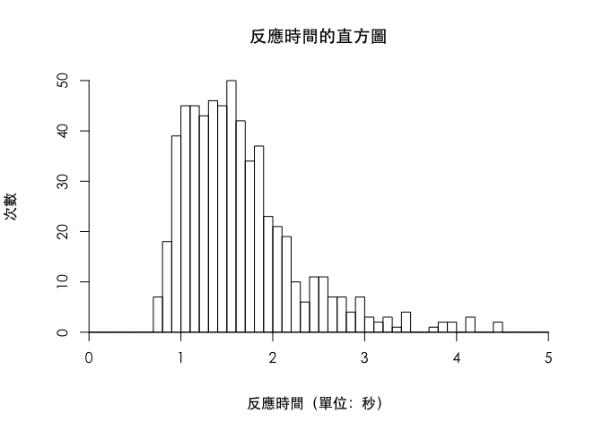

第三週課堂練習
================
蒲郁文
2018-03-13

設定環境
--------

Hint: Markdown Cheatsheet
<https://github.com/adam-p/markdown-here/wiki/Markdown-Cheatsheet>

``` r
knitr::opts_chunk$set(echo = TRUE)  # 是否顯示程式碼
```

``` r
Sys.getlocale(category = "LC_ALL")
```

    ## [1] "zh_TW.UTF-8/zh_TW.UTF-8/zh_TW.UTF-8/C/zh_TW.UTF-8/zh_TW.UTF-8"

``` r
Sys.setlocale(category = "LC_ALL", locale = "zh_TW.UTF-8")
```

    ## [1] "zh_TW.UTF-8/zh_TW.UTF-8/zh_TW.UTF-8/C/zh_TW.UTF-8/zh_TW.UTF-8"

    ## [1] 30

讀入資料集
----------

Hint: read.table(file, header = FALSE, sep = "", quote = ""'", row.names, na.strings = "NA")
The default separator is ‘white space’, that is one or more spaces, tabs, newlines or carriage returns.

``` r
mental_rotation <- read.table("Tab3-1.dat", header = TRUE)
names(mental_rotation)
```

    ## [1] "Trial"    "Angle"    "Stimulus" "Response" "RTmsec"   "Accuracy"
    ## [7] "RTsec"

``` r
dim(mental_rotation)
```

    ## [1] 600   7

``` r
head(mental_rotation)
```

    ##   Trial Angle Stimulus Response RTmsec Accuracy RTsec
    ## 1     1   140   Same--   Same--   4422        1  4.42
    ## 2     2    60   Same--   Same--   1750        1  1.75
    ## 3     3   180   Mirror   Mirror   1437        1  1.44
    ## 4     4   100   Mirror   Same--   1735        0  1.74
    ## 5     5   160   Mirror   Mirror   1937        1  1.94
    ## 6     6   180   Mirror   Mirror   1422        1  1.42

畫直方圖
--------

``` r
par(family="STHeiti")  # 設定中文字型
seq(from = 0, to = 50, by = 10)
```

    ## [1]  0 10 20 30 40 50

``` r
hist(mental_rotation$RTsec, breaks = seq(from = 0, to = 5, by = 0.1), xlim = c(0, 5),
     main = "反應時間的直方圖", xlab = "反應時間（單位：秒）", ylab = "次數",
     xaxt = "n", yaxt = "n")  # 不顯示 x、y 軸
axis(1, at = seq(from = 0, to = 5, by = 1), pos = 0, las = 0)
axis(2, at = seq(from = 0, to = 50, by = 10), pos = 0, las = 0)
```



基本 data frame 語法
--------------------

``` r
foo <- c("中文", "測試", "可以", "輸出")
foo
```

    ## [1] "中文" "測試" "可以" "輸出"

``` r
foo <- foo[foo != "中文"]
foo
```

    ## [1] "測試" "可以" "輸出"

``` r
foo <- c(foo, "新增")
foo
```

    ## [1] "測試" "可以" "輸出" "新增"

``` r
bar <- c(10, 20, 30, 40)
bar
```

    ## [1] 10 20 30 40

``` r
foobar <- data.frame(name = foo, age = bar)
foobar
```

    ##   name age
    ## 1 測試  10
    ## 2 可以  20
    ## 3 輸出  30
    ## 4 新增  40

``` r
foobar$other <- c("a", "b", "c", "d")
foobar
```

    ##   name age other
    ## 1 測試  10     a
    ## 2 可以  20     b
    ## 3 輸出  30     c
    ## 4 新增  40     d

基本運算與繪圖
--------------

``` r
12*3+sqrt(25)
```

    ## [1] 41

``` r
r <- 10
pi*r^2
```

    ## [1] 314.1593

``` r
year <- c(2005, 2008, 2012, 2018)
plot(year, bar, pch = 16)
```


``` r
plot(bar~year)
```


``` r
png("test.png", width = 800, units = "px")
plot(pressure)
dev.off()
```

    ## quartz_off_screen 
    ##                 2

``` r
rm(x)
ls()
```

    ## [1] "bar"             "foo"             "foobar"          "mental_rotation"
    ## [5] "r"               "year"
