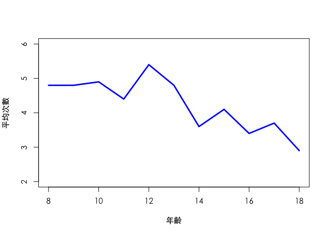
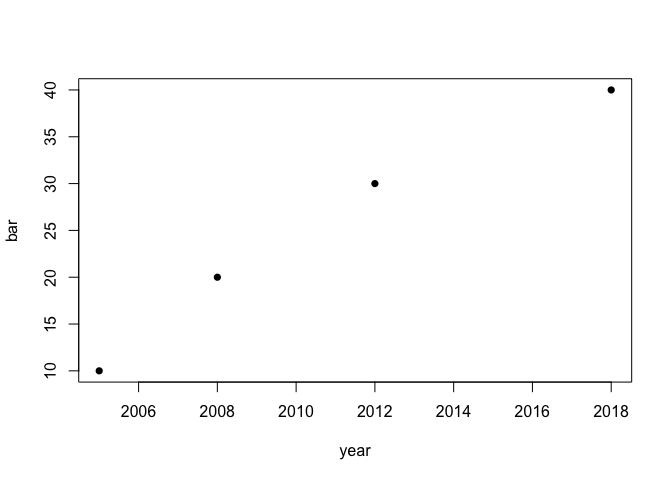
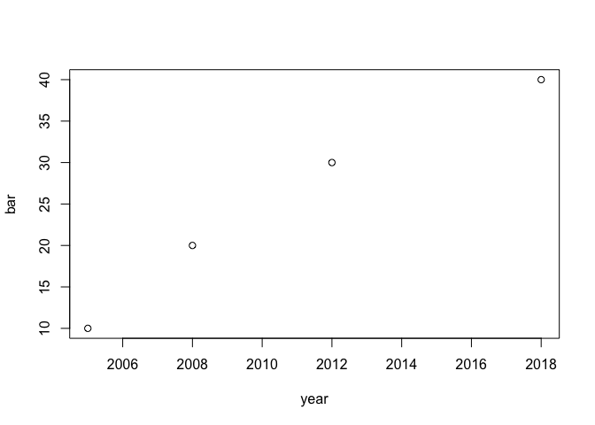

第三週課堂練習
================
蒲郁文
2018-03-13

設定環境
--------

Hint: Markdown Cheatsheet
<https://github.com/adam-p/markdown-here/wiki/Markdown-Cheatsheet>

``` r
knitr::opts_chunk$set(echo = TRUE)  # 是否顯示程式碼
```

``` r
Sys.getlocale(category = "LC_ALL")
```

    ## [1] "zh_TW.UTF-8/zh_TW.UTF-8/zh_TW.UTF-8/C/zh_TW.UTF-8/zh_TW.UTF-8"

``` r
Sys.setlocale(category = "LC_ALL", locale = "zh_TW.UTF-8")
```

    ## [1] "zh_TW.UTF-8/zh_TW.UTF-8/zh_TW.UTF-8/C/zh_TW.UTF-8/zh_TW.UTF-8"

    ## [1] 30

讀入資料集
----------

Hint: read.table(file, header = FALSE, sep = "", quote = ""'", row.names, na.strings = "NA")
The default separator is ‘white space’, that is one or more spaces, tabs, newlines or carriage returns.

``` r
mental_rotation <- read.table("Tab3-1.dat", header = TRUE)
names(mental_rotation)
```

    ## [1] "Trial"    "Angle"    "Stimulus" "Response" "RTmsec"   "Accuracy"
    ## [7] "RTsec"

``` r
dim(mental_rotation)
```

    ## [1] 600   7

``` r
head(mental_rotation)
```

    ##   Trial Angle Stimulus Response RTmsec Accuracy RTsec
    ## 1     1   140   Same--   Same--   4422        1  4.42
    ## 2     2    60   Same--   Same--   1750        1  1.75
    ## 3     3   180   Mirror   Mirror   1437        1  1.44
    ## 4     4   100   Mirror   Same--   1735        0  1.74
    ## 5     5   160   Mirror   Mirror   1937        1  1.94
    ## 6     6   180   Mirror   Mirror   1422        1  1.42

畫直方圖
--------

``` r
par(family="STHeiti")  # 設定中文字型
seq(from = 0, to = 50, by = 10)
```

    ## [1]  0 10 20 30 40 50

``` r
hist(mental_rotation$RTsec, breaks = seq(from = 0, to = 5, by = 0.1), xlim = c(0, 5),
     main = "反應時間的直方圖", xlab = "反應時間（單位：秒）", ylab = "次數",
     xaxt = "n", yaxt = "n")  # 不顯示 x、y 軸
axis(1, at = seq(from = 0, to = 5, by = 1), pos = 0, las = 0)
axis(2, at = seq(from = 0, to = 50, by = 10), pos = 0, las = 0)
```


畫莖葉圖
--------

``` r
stem(mental_rotation$RTsec, scale = .5)
```

    ## 
    ##   The decimal point is at the |
    ## 
    ##   0 | 7777777888888888888888888999999999999999999999999999999999999999
    ##   1 | 00000000000000000000000000000000000000000000011111111111111111111111+144
    ##   1 | 55555555555555555555555555555555555555555555555556666666666666666666+105
    ##   2 | 0000000000000011111111111111111111111111122222233333333334444444444
    ##   2 | 55555666666666666677888888888999
    ##   3 | 00000111223333
    ##   3 | 55558899
    ##   4 | 012244

``` r
stem(mental_rotation$RTsec, scale = 1)
```

    ## 
    ##   The decimal point is 1 digit(s) to the left of the |
    ## 
    ##    6 | 2222233
    ##    8 | 111113333333333333222222222222222222222222222222222224444
    ##   10 | 11111111112222222222233333333333333333333333322222222222222222222222+10
    ##   12 | 22222222222222222222233333333333344444444483333333333333333333333333+9
    ##   14 | 22222222222222222222444444444444444444444444411222223333333333333333+15
    ##   16 | 22222222222222222222222244444444444444444422222223333333333334444444
    ##   18 | 333333333333333333333333444444444448924444444444444444444448
    ##   20 | 3333333333333555555552222444444444444444
    ##   22 | 3333335555334444
    ##   24 | 2444444444522235555559
    ##   26 | 44444463555555
    ##   28 | 444622555
    ##   30 | 0055579
    ##   32 | 7004
    ##   34 | 5557
    ##   36 | 5
    ##   38 | 3618
    ##   40 | 26
    ##   42 | 0
    ##   44 | 24

``` r
stem(mental_rotation$RTsec, scale = 2)
```

    ## 
    ##   The decimal point is 1 digit(s) to the left of the |
    ## 
    ##    7 | 2222233
    ##    8 | 111113333333333333
    ##    9 | 222222222222222222222222222222222224444
    ##   10 | 111111111122222222222333333333333333333333333
    ##   11 | 222222222222222222222222222222222222222222244
    ##   12 | 2222222222222222222223333333333334444444448
    ##   13 | 3333333333333333333333333333333333333333333344
    ##   14 | 222222222222222222224444444444444444444444444
    ##   15 | 11222223333333333333333333333333333333333333333335
    ##   16 | 222222222222222222222222444444444444444444
    ##   17 | 2222222333333333333444444444444458
    ##   18 | 3333333333333333333333334444444444489
    ##   19 | 24444444444444444444448
    ##   20 | 333333333333355555555
    ##   21 | 2222444444444444444
    ##   22 | 3333335555
    ##   23 | 334444
    ##   24 | 24444444445
    ##   25 | 22235555559
    ##   26 | 4444446
    ##   27 | 3555555
    ##   28 | 4446
    ##   29 | 22555
    ##   30 | 00555
    ##   31 | 79
    ##   32 | 7
    ##   33 | 004
    ##   34 | 5557
    ##   35 | 
    ##   36 | 
    ##   37 | 5
    ##   38 | 36
    ##   39 | 18
    ##   40 | 
    ##   41 | 26
    ##   42 | 0
    ##   43 | 
    ##   44 | 24

畫背靠背莖葉圖
--------------

``` r
# total_points <- read.table(file.choose(), header = TRUE)
total_points <- read.table("Fig3-4.dat", header = TRUE)
names(total_points)
```

    ## [1] "Attend" "Points"

``` r
dim(total_points)
```

    ## [1] 72  2

``` r
str(total_points)
```

    ## 'data.frame':    72 obs. of  2 variables:
    ##  $ Attend: int  1 1 1 1 1 1 1 1 1 1 ...
    ##  $ Points: int  188 195 195 225 228 232 233 237 239 240 ...

``` r
tail(total_points)
```

    ##    Attend Points
    ## 67      2    297
    ## 68      2    298
    ## 69      2    310
    ## 70      2    320
    ## 71      2    321
    ## 72      2    328

``` r
rarely_attend <- total_points$Points[total_points$Attend == 1]
names(rarely_attend)
```

    ## NULL

``` r
dim(rarely_attend)
```

    ## NULL

``` r
head(rarely_attend)
```

    ## [1] 188 195 195 225 228 232

``` r
regularly_attend <- total_points$Points[total_points$Attend == 2]
head(regularly_attend)
```

    ## [1] 241 243 246 249 250 252

``` r
library(aplpack)
```

    ## Loading required package: tcltk

    ## Warning in fun(libname, pkgname): couldn't connect to display ":0"

``` r
stem.leaf.backback(rarely_attend, regularly_attend)
```

    ## ________________________________________
    ##   1 | 2: represents 12, leaf unit: 1 
    ##     rarely_attend      regularly_attend
    ## LO: 188 195 195                         
    ## ________________________________________
    ##    5           85| 22 |                 
    ##    9         9732| 23 |                 
    ##   10            0| 24 |1369         4   
    ##   (4)        6660| 25 |024456      10   
    ##   10         8441| 26 |123444577   19   
    ##    6        74400| 27 |012366788   (9)  
    ##                  | 28 |012488      20   
    ##                  | 29 |0112346678  14   
    ##    1            8| 30 |                 
    ##                  | 31 |0            4   
    ##                  | 32 |018          3   
    ##                  | 33 |                 
    ## ________________________________________
    ## n:             24      48           
    ## ________________________________________

畫折線圖
--------

``` r
# colors()  # 列出支援的顏色
```

``` r
freq <- c(4.8, 4.8, 4.9, 4.4, 5.4, 4.8, 3.6, 4.1, 3.4, 3.7, 2.9)
freq
```

    ##  [1] 4.8 4.8 4.9 4.4 5.4 4.8 3.6 4.1 3.4 3.7 2.9

``` r
age <- c(8:18)  # [8, 18]
age
```

    ##  [1]  8  9 10 11 12 13 14 15 16 17 18

``` r
par(family="STHeiti")
plot(freq~age, type = "l", ylim = c(2, 6),
     xlab = "年齡", ylab = "平均次數",
     col = "blue", lwd = 3)
```



基本 data frame 語法
--------------------

``` r
foo <- c("中文", "測試", "可以", "輸出")
foo
```

    ## [1] "中文" "測試" "可以" "輸出"

``` r
foo <- foo[foo != "中文"]
foo
```

    ## [1] "測試" "可以" "輸出"

``` r
foo <- c(foo, "新增")
foo
```

    ## [1] "測試" "可以" "輸出" "新增"

``` r
bar <- c(10, 20, 30, 40)
bar
```

    ## [1] 10 20 30 40

``` r
foobar <- data.frame(name = foo, age = bar)
foobar
```

    ##   name age
    ## 1 測試  10
    ## 2 可以  20
    ## 3 輸出  30
    ## 4 新增  40

``` r
foobar$other <- c("a", "b", "c", "d")
foobar
```

    ##   name age other
    ## 1 測試  10     a
    ## 2 可以  20     b
    ## 3 輸出  30     c
    ## 4 新增  40     d

基本運算與繪圖
--------------

``` r
12*3+sqrt(25)
```

    ## [1] 41

``` r
r <- 10
pi*r^2
```

    ## [1] 314.1593

``` r
year <- c(2005, 2008, 2012, 2018)
plot(year, bar, pch = 16)
```



``` r
plot(bar~year)
```



``` r
png("test.png", width = 800, units = "px")
plot(pressure)
dev.off()
```

    ## quartz_off_screen 
    ##                 2

``` r
rm(x)
ls()
```

    ##  [1] "age"              "bar"              "foo"             
    ##  [4] "foobar"           "freq"             "mental_rotation" 
    ##  [7] "r"                "rarely_attend"    "regularly_attend"
    ## [10] "total_points"     "year"
