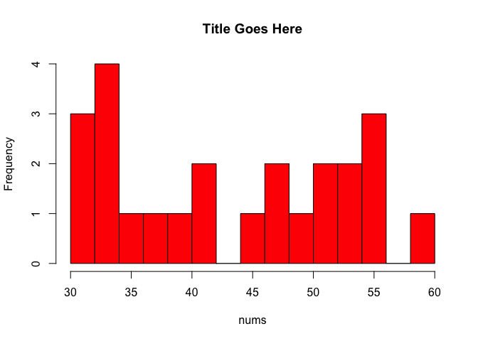

Week 4 Practice 1
================

Central Tendency
----------------

``` r
nums <- sample(30:60, 24, replace=TRUE)
cat(nums)
```

    ## 33 42 32 56 55 47 34 47 52 49 36 60 45 34 38 39 54 30 42 33 30 51 54 55

``` r
summary(nums)
```

    ##    Min. 1st Qu.  Median    Mean 3rd Qu.    Max. 
    ##   30.00   34.00   43.50   43.67   52.50   60.00

``` r
m <- mean(nums)
m.trim <- mean(nums, trim = .1)
med <- median(nums)
cat(m, m.trim, med)
```

    ## 43.66667 43.6 43.5

``` r
hist(nums, main = "Title Goes Here", breaks = 20, col = "red")
```



``` r
library("psych")
describe(nums)
```

    ##    vars  n  mean   sd median trimmed   mad min max range skew kurtosis
    ## X1    1 24 43.67 9.57   43.5    43.6 14.08  30  60    30 0.04    -1.53
    ##      se
    ## X1 1.95

Data Types
----------

``` r
scalar_var1 <- 6
scalar_var2 <- "STRING"
scalar_var3 <- TRUE
```

``` r
vector_var1 <- c(1, 3, 5, 7, 9)
vector_var2 <- c("apple", "boy", "cat", "dog", 'egg', 'fox', 'girl')
vector_var3 <- c(61:70)
vector_var1[3]  # 索引值從 1 開始
```

    ## [1] 5

``` r
vector_var2[c(2, 4, 6)]
```

    ## [1] "boy" "dog" "fox"

``` r
vector_var3[7:10]  # 包含頭尾
```

    ## [1] 67 68 69 70

``` r
vector_var3[11]  # 不存在，NA
```

    ## [1] NA
