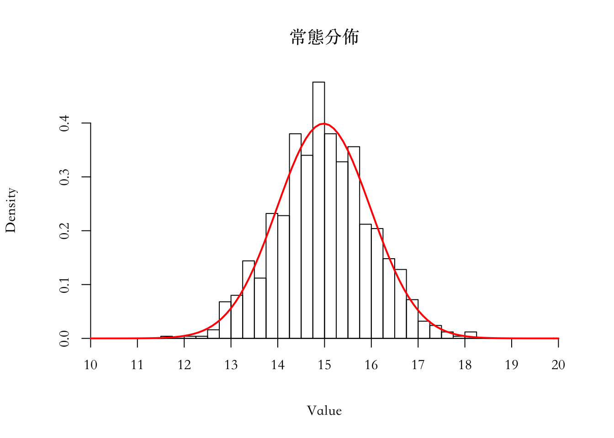
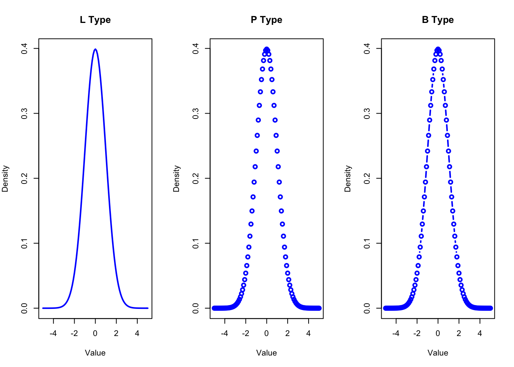
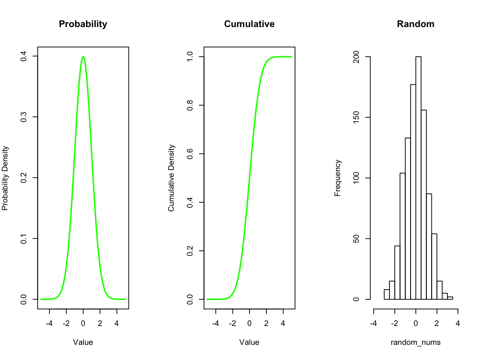
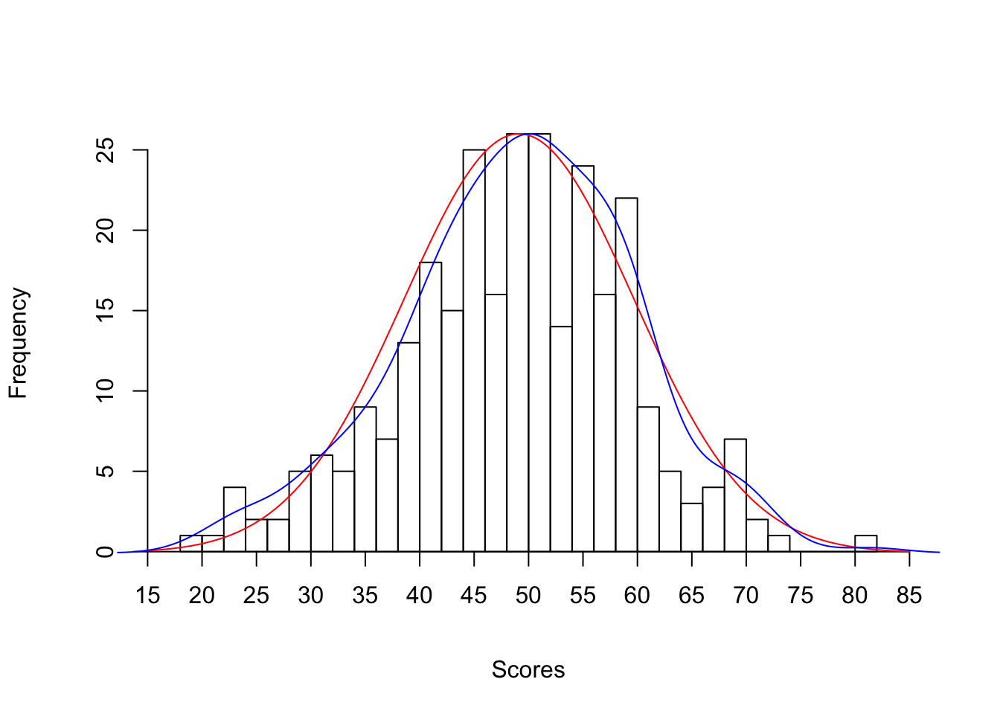

Week 7 Practice 1
================
Yu-Wen Pu
2018-04-10

``` r
knitr::opts_chunk$set(results = "hold", fig.retina = 2)
set.seed(1830)
```

生成數值
--------

``` r
y <- rnorm(1000, mean = 15, sd = 1)
mean(y)
sd(y)
```

    ## [1] 14.98172
    ## [1] 0.9999644

畫圖，疊加曲線
--------------

``` r
par(family = "STSongti-TC-Regular")
hist(y, prob = TRUE, breaks = seq(from = 10, to = 20, by = .25),
     main = "常態分佈", xlab = "Value", ylab = "Density",
     xaxt = "n", yaxt = "n")  # prob = TRUE 也可以換成 freq = FALSE
axis(side = 1, at = seq(from = 10, to = 20, by = 1), pos = 0, las = 0)
  # side: 1 below, 2 left, 3 above, 4 right
  # las: 標籤的方向
  #      0 parallel to axis, 1 horizontal
  #      2 perpendicular to axis, 3 vertical
axis(side = 2, pos = 10, las = 0)  # pos: y 軸要畫在 x 坐標的哪個位置
  # curve() 裡的變數 x 是自動創建的
curve(dnorm(x, mean = mean(y), sd = sd(y)), add = TRUE, col = "red", lwd = 2)
```



使用 par 設定圖形參數，使用 type 設定圖形式樣
---------------------------------------------

``` r
x <- seq(from = -5, to = 5, by = .1)
densities <- dnorm(x)  # defaults to mean = 0, sd = 1
cumulative_qtys <- pnorm(x)
random_nums <- rnorm(1000)
par(mfrow = c(1, 3), mar = c(5, 4, 4, 2))
  # multiple figures by row, c(row, column)
  # margin size, c(bottom, left, top, right)
plot(x, densities, col = "blue", type = "l", lwd = 2,
     xlab = "Value", ylab = "Density", main = "L Type")
  # type of plot, l: line, p: point, b: both
plot(x, densities, col = "blue", type = "p", lwd = 2,
     xlab = "Value", ylab = "Density", main = "P Type")
plot(x, densities, col = "blue", type = "b", lwd = 2,
     xlab = "Value", ylab = "Density", main = "B Type")
```



承上，比較圖形
--------------

``` r
par(mfrow = c(1, 3), mar = c(5, 4, 5, 4))
plot(x, densities, col = "green", type = "l", lwd = 2,
     xlab = "Value", ylab = "Probability Density", main = "Probability")
plot(x, cumulative_qtys, col = "green", type = "l", lwd = 2,
     xlab = "Value", ylab = "Cumulative Density", main = "Cumulative")
hist(random_nums, xlim = c(-4, 4), main = "Random")
```



讀入資料
--------

``` r
scores <- read.table("Fig6-3.dat", header = TRUE)
head(scores)
length(scores$BehavProbTot)
mean(scores$BehavProbTot)
sd(scores$BehavProbTot)
```

    ##   id BehavProbTot
    ## 1  1         19.5
    ## 2  2         21.5
    ## 3  3         23.5
    ## 4  4         23.5
    ## 5  5         23.5
    ## 6  6         23.5
    ## [1] 289
    ## [1] 49.11938
    ## [1] 10.54786

畫直方圖、常態分佈曲線、最接近實際值的曲線
------------------------------------------

``` r
hist(scores$BehavProbTot, breaks = 35, xlim = c(15, 85),
     xlab = "Scores", main = "", xaxt = "n", yaxt = "n")
axis(side = 1, at = seq(from = 15, to = 85, by = 5), pos = 0, las = 0)
axis(side = 2, pos = 15, las = 0)
par(new = TRUE)  # 疊加圖形
x <- seq(from = 15, to = 85, by = .01)
plot(x, dnorm(x, mean = mean(scores$BehavProbTot), sd = sd(scores$BehavProbTot)),
     type = "l", xlim = c(15, 85), xlab = "", ylab = "", col = "red",
     xaxt = "n", yaxt = "n", bty = "n")  # bty = "n": no border
  # lines() 會疊加在既有圖形上
lines(density(scores$BehavProbTot), col = "blue")  # kernel density estimation
```


