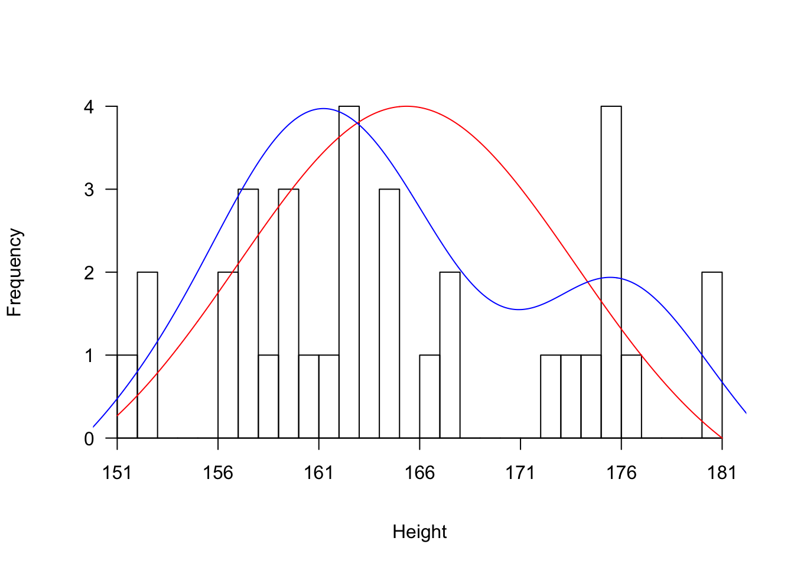
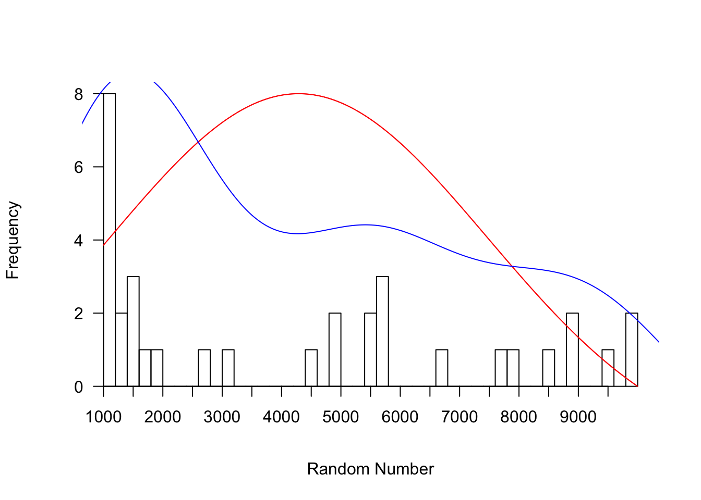

Week 7 Practice 2
================
Yu-Wen Pu
2018-04-10

``` r
knitr::opts_chunk$set(results = "hold", fig.retina = 2)
set.seed(1830)
```

讀入資料，並指定資料型別
------------------------

``` r
survey <- read.table("2018class.csv", header = TRUE, sep = ",", colClasses = c(
    "numeric", "integer", "factor", "numeric", "numeric",
    "numeric", "integer", "factor", "integer", "integer"))
head(survey)
str(survey)
```

    ##   height heartbeat gender haircut lunch money random smoke sleep profage
    ## 1    153        72      1       0    65  1200   8888     1     0      50
    ## 2    162        69      1     650    70   455   1000     1     0      53
    ## 3    158        66      1     600    65   276   5542     1     0      55
    ## 4    176        78      2     200    70  4000   1111     1    23      45
    ## 5    181        72      2     200    75   735   5487     1    23      59
    ## 6    181        70      2     100    70   200   8591     1     0      52
    ## 'data.frame':    34 obs. of  10 variables:
    ##  $ height   : num  153 162 158 176 181 181 161 165 151 176 ...
    ##  $ heartbeat: int  72 69 66 78 72 70 80 70 76 80 ...
    ##  $ gender   : Factor w/ 2 levels "1","2": 1 1 1 2 2 2 1 1 1 2 ...
    ##  $ haircut  : num  0 650 600 200 200 100 650 1200 560 160 ...
    ##  $ lunch    : num  65 70 65 70 75 70 88 110 65 80 ...
    ##  $ money    : num  1200 455 276 4000 735 ...
    ##  $ random   : int  8888 1000 5542 1111 5487 8591 1024 5678 1000 5649 ...
    ##  $ smoke    : Factor w/ 2 levels "1","2": 1 1 1 1 1 1 1 1 1 1 ...
    ##  $ sleep    : int  0 0 0 23 23 0 0 0 0 0 ...
    ##  $ profage  : int  50 53 55 45 59 52 52 47 42 19 ...

Encode Vector as Factor (Category, Enum)
----------------------------------------

``` r
survey$gender <- factor(survey$gender,
    levels = c(1, 2), labels = c("female", "male"))
str(survey$gender)
table(survey$gender)
survey$smoke <- factor(survey$smoke, ordered = TRUE,
    levels = c(1, 2), labels = c("no", "yes"))
str(survey$smoke)
table(survey$smoke)
head(survey)
```

    ##  Factor w/ 2 levels "female","male": 1 1 1 2 2 2 1 1 1 2 ...
    ## 
    ## female   male 
    ##     24     10 
    ##  Ord.factor w/ 2 levels "no"<"yes": 1 1 1 1 1 1 1 1 1 1 ...
    ## 
    ##  no yes 
    ##  33   1 
    ##   height heartbeat gender haircut lunch money random smoke sleep profage
    ## 1    153        72 female       0    65  1200   8888    no     0      50
    ## 2    162        69 female     650    70   455   1000    no     0      53
    ## 3    158        66 female     600    65   276   5542    no     0      55
    ## 4    176        78   male     200    70  4000   1111    no    23      45
    ## 5    181        72   male     200    75   735   5487    no    23      59
    ## 6    181        70   male     100    70   200   8591    no     0      52

畫直方圖、常態分佈曲線、最接近實際值的曲線 - height
---------------------------------------------------

``` r
hist(survey$height, breaks = 35, xlim = c(min(survey$heigh), max(survey$heigh)),
     xlab = "Height", main = "", xaxt = "n", yaxt = "n")
axis(side = 1, at = seq(from = min(survey$heigh), to = max(survey$heigh), by = 5),
     pos = 0, las = 0)
axis(side = 2, pos = min(survey$heigh), las = 2)
par(new = TRUE)  # 疊加圖形
x <- seq(from = min(survey$heigh), to = max(survey$heigh), by = .01)
plot(x, dnorm(x, mean = mean(survey$heigh), sd = sd(survey$heigh)),
     type = "l", col = "red", xlim = c(min(survey$heigh), max(survey$heigh)),
     xlab = "", ylab = "", xaxt = "n", yaxt = "n", bty = "n")  # bty = "n": no border
  # lines() 會疊加在既有圖形上
lines(density(survey$heigh), col = "blue")  # kernel density estimation
```



畫直方圖、常態分佈曲線、最接近實際值的曲線 - random
---------------------------------------------------

``` r
hist(survey$random, breaks = 35, xlim = c(min(survey$random), max(survey$random)),
     xlab = "Random Number", main = "", xaxt = "n", yaxt = "n")
axis(side = 1, at = seq(from = min(survey$random), to = max(survey$random), by = 500),
     pos = 0, las = 0)
axis(side = 2, pos = min(survey$random), las = 2)
par(new = TRUE)  # 疊加圖形
x <- seq(from = min(survey$random), to = max(survey$random), by = .1)
plot(x, dnorm(x, mean = mean(survey$random), sd = sd(survey$random)),
     type = "l", col = "red", xlim = c(min(survey$random), max(survey$random)),
     xlab = "", ylab = "", xaxt = "n", yaxt = "n", bty = "n")  # bty = "n": no border
  # lines() 會疊加在既有圖形上
lines(density(survey$random), col = "blue")  # kernel density estimation
```


